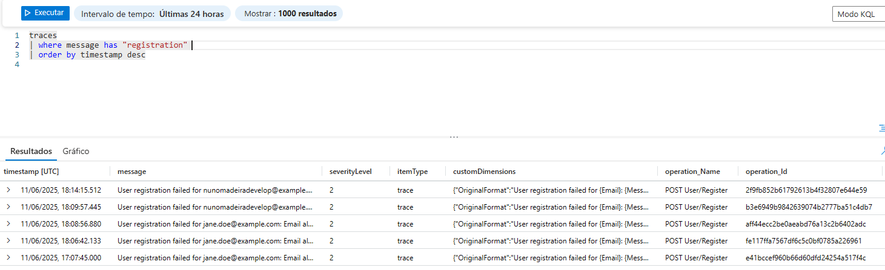

# Development Notes

## API

We've fixed an identified issue related to Migrations by removing the project dependency:


The rental aggregate was created this sprint. However, when creating a rental, an issue was identified in the EF (Entity Framework) that could not be corrected.


In any case, for demonstration purposes, the validation that was affecting the functionality has been removed.

### Swagger

We implemented Swagger so that we could have better visibility over the application's endpoints:


In addition, we can also see a list of the schemas used.


---

## Keycloak

---

## Logging Implementation

Logging is a core part of our application observability strategy. It is implemented using the built-in `ILogger<T>` interface in ASP.NET Core and is integrated with **Azure Application Insights** for centralized monitoring and diagnostics.

### Configuration

Logging is configured in `Startup.cs`. We enabled Application Insights via:

```csharp
options.ConnectionString = "InstrumentationKey=7cf64314-a013-42a7-9871-7ff3c401d98b;IngestionEndpoint=https://westeurope-5.in.applicationinsights.azure.com/;LiveEndpoint=https://westeurope.livediagnostics.monitor.azure.com/;ApplicationId=d37599ab-0a53-4de7-9452-8fd271a3dc6d";
```

## Verifying Logs in Application Insights

Once logging is configured and the application is deployed, telemetry and logs are automatically sent to Azure Application Insights.

### Example Log Code

In the `UserController`, we log key registration events:

```csharp
[HttpPost("register")]
public async Task<IActionResult> Register([FromBody] NewUserDTO request)
{
    _logger.LogInformation("New user registration attempt for email {Email} at {Time}", request.Email, DateTime.UtcNow);
    try
    {
        await _userService.CreateUserAsync(request);
        _logger.LogInformation("User {Email} registered successfully at {Time}", request.Email, DateTime.UtcNow);
        return Ok(new { message = "User registered successfully" });
    }
    catch (BusinessRulesException ex)
    {
        _logger.LogWarning("User registration failed for {Email}: {Message} at {Time}", request.Email, ex.Message, DateTime.UtcNow);
        return BadRequest(new { message = ex.Message });
    }
}
```
Logs can be queried using Log Analytics in Azure Portal with Kusto Query Language (KQL).


