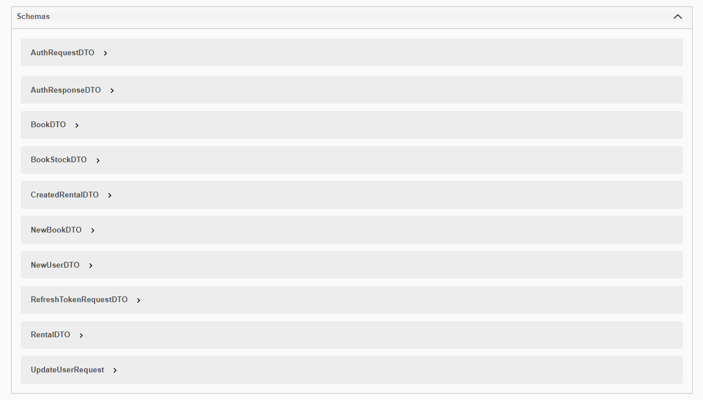

# Development Notes

## API

We've fixed an identified issue related to Migrations by removing the project dependency:

The rental aggregate was created this sprint. However, when creating a rental, an issue was identified in the EF (Entity Framework) that could not be corrected.

In any case, for demonstration purposes, the validation that was affecting the functionality has been removed.

### Swagger

We implemented Swagger so that we could have better visibility over the application's endpoints:

In addition, we can also see a list of the schemas used.

---

## Keycloak

