# Infrastructure

## Azure Infra

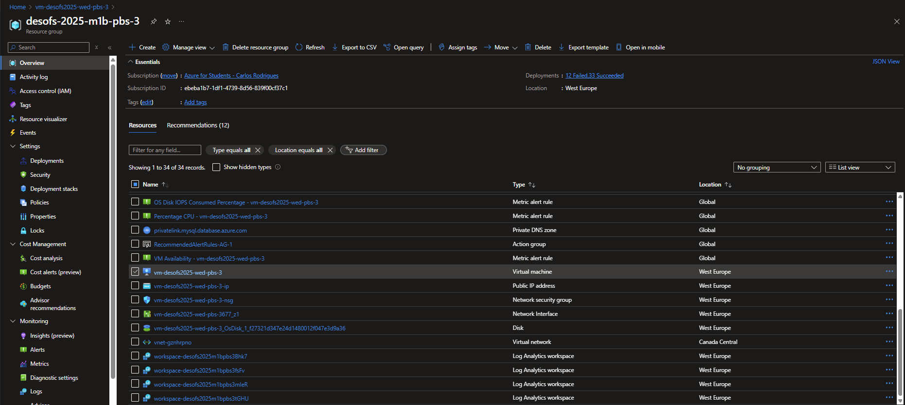

* For this project, a virtual machine was created in Azure to serve as a production environment for the system.
* All the system components mentioned in the following section have been implemented on the machine.
* Only the API and DB are accessible externally and the keycloak is restricted to the internal network.


### Azure Virtual Machine - General Overview - vm-desofs2025-wed-pbs-3

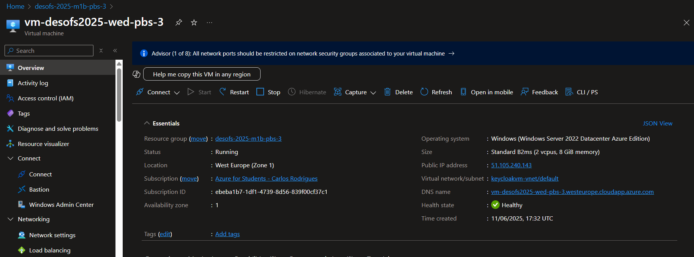

| **Property**          | **Value**                                             |
|-----------------------|-------------------------------------------------------|
| **VM Name**           | vm-desofs2025-wed-pbs-3                               |
| **Location**          | West Europe (Zone 1)                                  |
| **Operating System**  | Windows Server 2022 Datacenter Azure Edition          |
| **Size**              | Standard B2ms (2 vCPUs, 8 GiB memory)                 |
| **Resource Group**    | desofs-2025-m1b-pbs-3                                 |
| **Public IP Address** | 51.105.240.143                                        |
| **Virtual Network**   | keycloakvm-vnet/default                               |
| **DNS Name**          | vm-desofs2025-wed-pbs-3.westeurope.cloudapp.azure.com |
| **Health State**      | Healthy                                               |
| **Time Created**      | 11/06/2025, 17:32 UTC                                 |
| **Availability Zone** | 1                                                     |

### Networking

* Public IP address: 51.105.240.143
* Virtual network/subnet:keycloakvm-vnet/default
* DNS name:vm-desofs2025-wed-pbs-3.westeurope.cloudapp.azure.com

**Rules**:

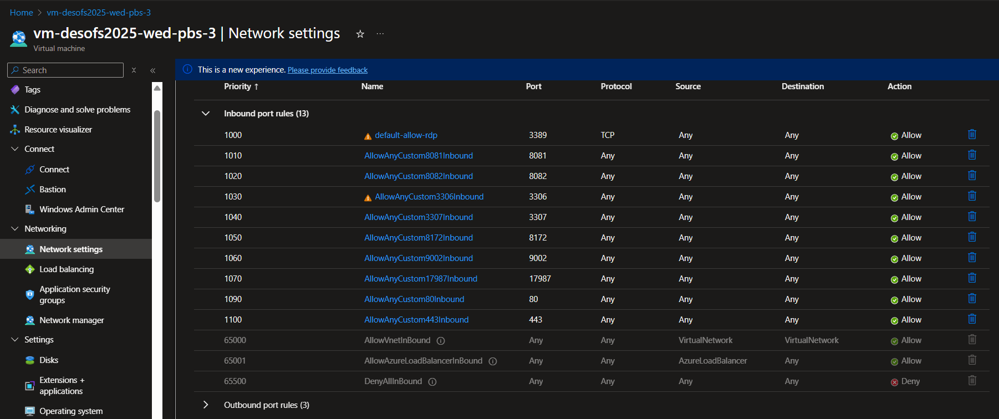


### Backups

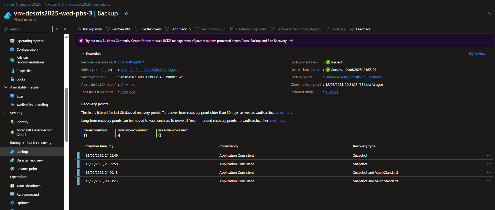

As you can see in the image above, backups have been activated for the vm.

The backup policy is as follows:

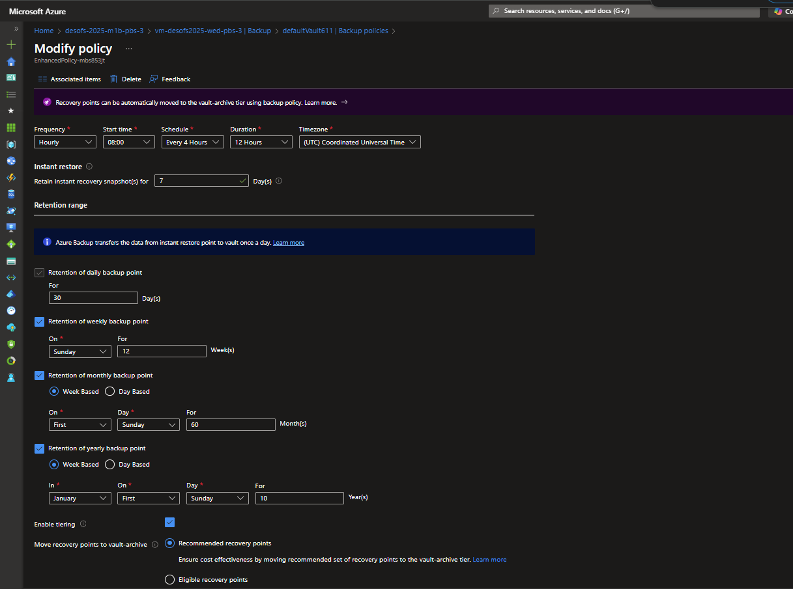

**Backup Policy Summary**

**Policy Name**: EnhancedPolicy-mb853f

**Backup Frequency and Schedule**:
* Backups are taken every 4 hours, starting at 08:00 UTC.
* Each backup job runs for a duration of 12 hours.


**Retention Range**:

* Daily Backups: Retained for 30 days.
* Weekly Backups: Retained for 12 weeks, with backups taken every Sunday.
* Monthly Backups: Retained for 60 months, with backups taken on the first Sunday of each month.
* Yearly Backups: Retained for 10 years, with backups taken on the first Sunday of January each year.

**Tiering Option**

Tiering is enabled.

* Recovery points are automatically moved to the vault-archive tier based on recommended recovery points, ensuring cost effectiveness by leveraging lower-cost storage for long-term retention.

`
This configuration leverages Azure Backup’s tiering capabilities to optimise storage costs while maintaining a robust retention strategy for daily, weekly, monthly, and yearly backups
`

### Disaster Recovery

**Backup Source**:
Use the latest valid backup from the Azure Recovery Services Vault.

**Restore Process**:

* In the Azure portal, navigate to the Recovery Services Vault.
* Select the backup item for the affected VM.
* Choose the desired recovery point.
* Select the option to "Restore to a new VM."
* Configure the new VM (name, resource group, network, etc.) as needed.
* Initiate the restore operation; Azure will provision a new VM with the restored disks and configuration.

**Post-Restore Steps**:

* Reapply any custom configurations, environment variables, and secrets.
* Validate connectivity for API and DB endpoints.
* Restrict Keycloak access to the internal network as previously configured.
* Re-enable monitoring via Application Insights by restoring the connection string.
* Test all system components to confirm full functionality.


## Components

Environment variables have been created for all components to allow applications and services to run without exposing passwords in the code:

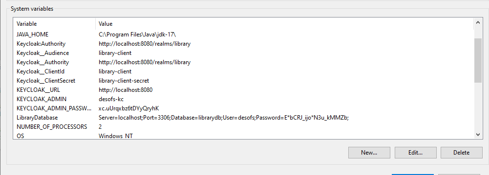


---

### DATABASE

The following components were installed to run the Database:

* MYSQL


#### Configuration

MySQL has been installed and 2 databases have been configured:

* librarydb - for the API
* keycloak - for the keycloak


For the librarydb, on the application we run the following commands to create the database tables:

Removing old schemas:

``` bash
dotnet ef migrations remove 
```
Creating new schemas:

``` bash
dotnet ef migrations add LibraryOnlineRentalSystem
```

Updating the database:
``` bash
dotnet ef database update
```

---

### API

The following components were installed to run the API:

* IIS
* dotnet host bundle
* Github Runner (responsible for deploying the code in IIS)


#### Configuration

We started by creating a new site in IIS, as shown in the following printout:

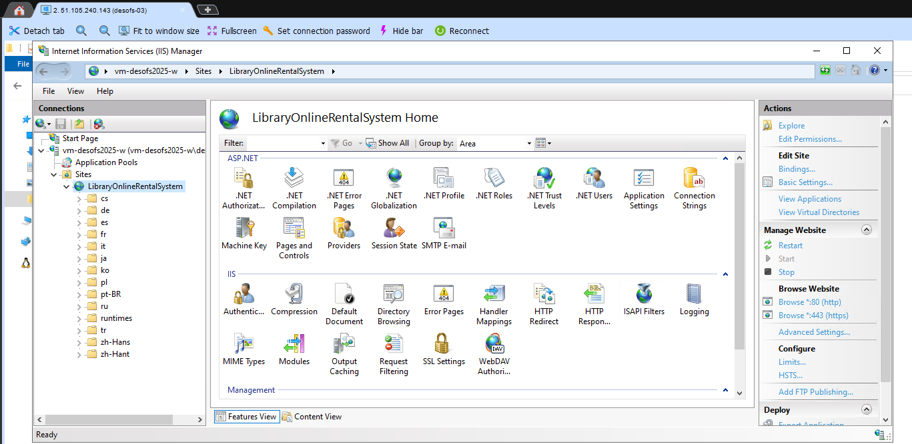

A runner was created on github:

.

The runner is responsible for downloading the artefact and installing it in the virtual machine's IIS, specifically in the following directory:

`C:\inetpub\wwwroot\LibraryOnlineRentalSystem`

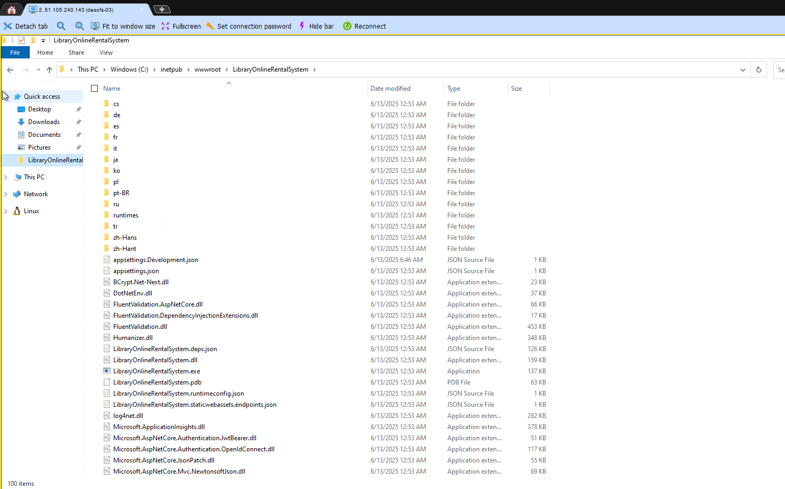

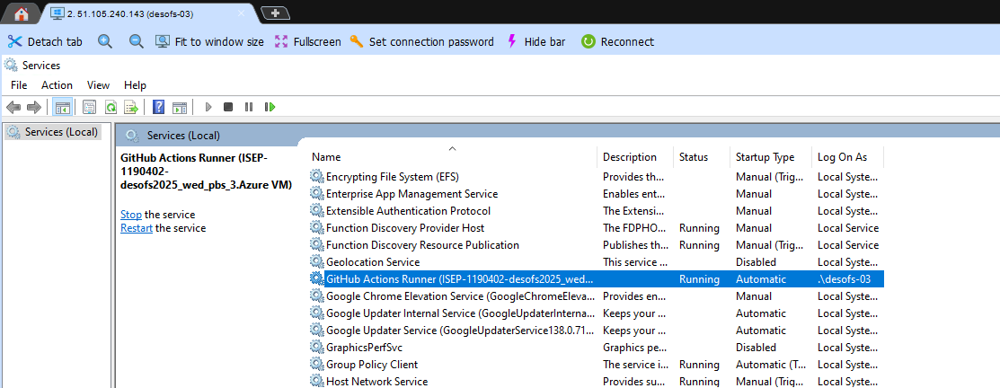

This made it possible to deploy the API on the server:
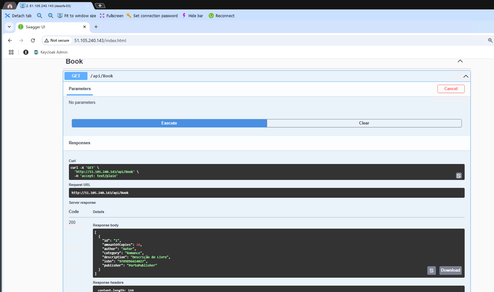

---

### KEYCLOAK

In order to run KEYCLOAK, the following components were installed:

* Java 17
* Keycloak [keycloak-26.2.5](https://github.com/keycloak/keycloak/releases/download/26.2.5/keycloak-26.2.5.zip)

#### Configuration

The ZIP was downloaded and the application was placed in the following folder:

`C:\Program Files\keycloak-26.2.5`.

Next, the configuration file was changed with the information needed to connect the application to the database:

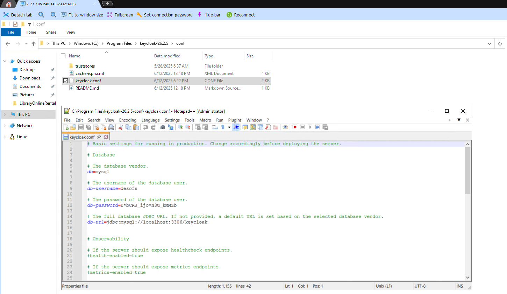

Config file copy:

[keycloak.conf](Pictures/keycloak.conf)


Keycloak website running:

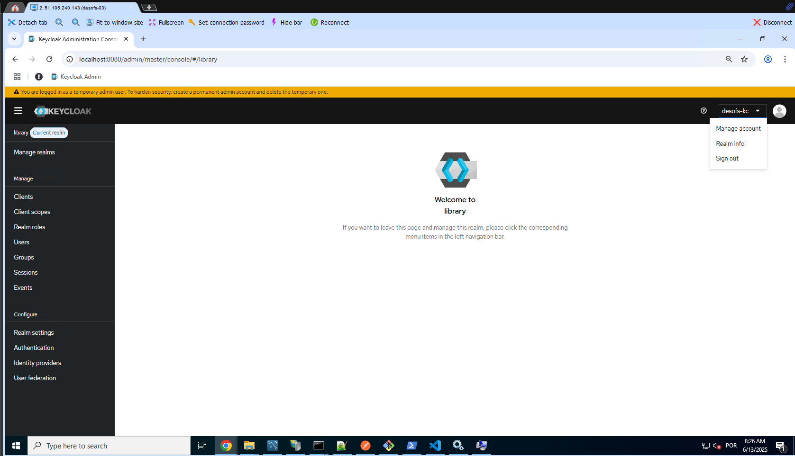

To make it easier to run the service, the following script was created:

```bash
@echo off
cd /d "C:\Program Files\keycloak-26.2.5\bin"
start "" /min kc.bat start-dev`
```

---

## AI-libraryrentalsystem - Application Insights

**Application Insights** is a feature of Azure Monitor used to collect telemetry data such as request rates, response
times, failure rates, and diagnostic traces. In the **AI-libraryrentalsystem**, it provides visibility into the health,
performance, and usage patterns of the system, enabling proactive monitoring and rapid issue resolution.

[Open on Azure](https://portal.azure.com/#@myisepipp.onmicrosoft.com/resource/subscriptions/ebeba1b7-1df1-4739-8d56-839f00cf37c1/resourceGroups/desofs-2025-m1b-pbs-3/providers/microsoft.insights/components/AI-libraryrentalsystem/overview)


### Integration Details

- Application Insights is enabled in the application via the Azure SDK for ASP.NET Core.
- The configuration is set using the **Application Insights Connection String**, stored in an environment variable:

---

```json
{
  "ApplicationInsights": {
    "ConnectionString": "InstrumentationKey=7cf64314-a013-42a7-9871-7ff3c401d98b;IngestionEndpoint=https://westeurope-5.in.applicationinsights.azure.com/;LiveEndpoint=https://westeurope.livediagnostics.monitor.azure.com/;ApplicationId=d37599ab-0a53-4de7-9452-8fd271a3dc6d"
  }
}
```

---

## Security & Privacy

Sensitive information such as connection strings and user data is not logged. Only metadata and performance telemetry
are collected. Telemetry data is encrypted in transit and at rest within Azure.

---

## Monitoring & Observability

Developers and maintainers can monitor metrics and traces using the Azure Portal > Application Insights dashboard, which
provides:

- **Live Metrics Stream** – Real-time health and performance data
- **Failures** – Shows exceptions and failed requests
- **Performance** – Tracks response times and load
- **Usage** – Page views, session counts, and user behavior
- **Logs (Log Analytics)** – Deep queries with **Kusto Query Language (KQL)**

### Benefits

- Enables **DevOps** and **DevSecOps** practices with continuous monitoring
- Reduces **MTTR (Mean Time to Recovery)** during production incidents
- Supports **data-driven** decisions for performance optimizations
- Allows integration with **alerts, dashboards**, and **workbooks** in Azure Monitor
