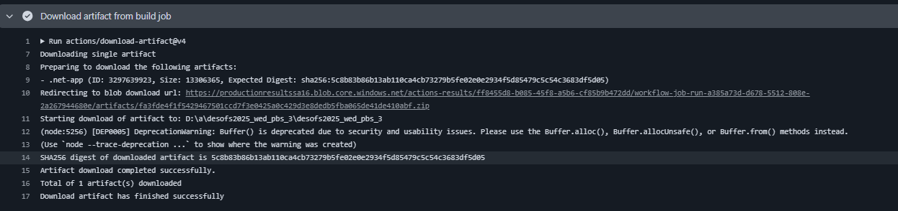

**Build**

Aqui temos um build que tem por funcionalidade de compilar todo os projeto que está na liguagem .Net. Logo abaixo iremos mostrar como está estrutura do mesmo.

Em seguinda o mesmo realiza um checkout nas branchs existentes e realiza a instalação do .Net. Apois a instalação corre o serviço e faz um publish. 
Depois realiza uploads dos artefatos.

Aqui temos um print desta pipeline a rodar.

**Deploy**

Apos corre todas essas etapadas, dentro do mesmo codigo, chamamos o deploy. 

Onde possui a seguinte estrutura:

Tendo como funcionalidade de baixar os artefatos que foram inseridos no Azure.

Depois fazemos login na plataforma atraves do token.

Logo em seguinda rodamos o Deploy dentro do Azure.

Sendo assim o processo ele é concluido com sucesso.

**Obs:**
 O deploy tem a finalidade de colocar nossa app no ar, ou seja, ficar acessivel por outras pessoas pela internet ou intranet.
Entretanto existem varias ferramentas que podemos utilizar para realiar um deplou, tais elas são:
* GitHub (código-fonte)

* Vercel ou Netlify (para front-end)

* Render, Heroku, Railway, ou DigitalOcean (para back-end)

* Docker (para empacotar e rodar apps)

O que nos utilizamos foi o AZURE.
