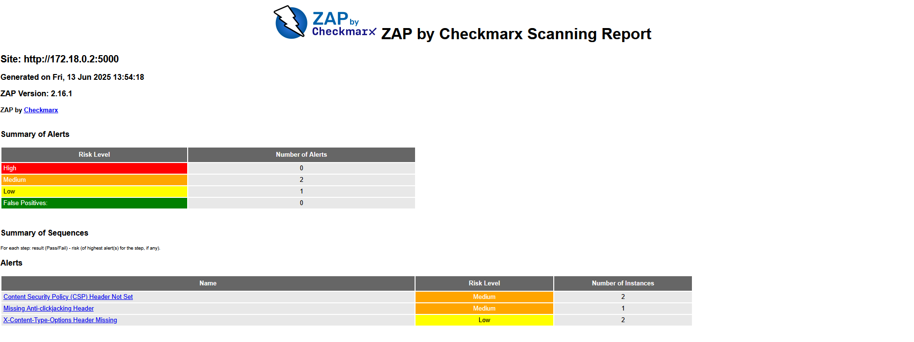

### **Metodologia CSA- Teste Dinâmico de Segurança de Aplicações**
CSA Realiza uma análise de segurança e qualidade de código feito em .NET. 

Está pipeline  é dividida em várias etapas organizadas logicamente para validar o projeto a cada, pull request. 

Passando a ser validado por algum membro da equipa.

**Objetivos**

Avaliar continuamente a segurança da aplicação, onde integrar verificações de segurança em todas as fases do ciclo de desenvolvimento. Alem de Detectar falhas de segurança em codigo-fonte, dependencias e containers. Faz testes dinamicos onde verifica em tempo de execução(APIs). Garantir qualidade de codigo, onde mantem padroes de codigo limpo e seguro com metricas objetivas.

**Abordagem**
A pipeline é executada nos eventos Pull_request ou manualmente, em todas as  branchs disponivies. Utiliza  o SonarCloud para uma analise estatida do codigo com cobertura de testes, alem de acionar o Snyk que faz dupla verificação SAST mais analises de vulnerabilidades. utiliza Owasp para um teste dinamico na API exposta, em seguida  gera relatorios  

**Ferramentas comuns CSA**


## **Estrutura CSA**

```
┌──────────────────────────────┐
│       GatIlhos (Triggers)    │
├──────────────────────────────┤
│ • PR em qualquer branch      │              
│ • execução manual (dispatch) │
└─────────────┬────────────────┘
              │
              ▼
┌─────────────────────────────────────────────┐
│                  Job: csa                   │
├─────────────────────────────────────────────┤
│ Ambiente: ubuntu-latest                     │
│ Timeout: 45 minutos                         │
│ Condição: somente em PRs com sucesso        │
└─────────────┬───────────────────────────────┘
              │
              ▼
┌──────────────────────────────────────────────────────┐
│                     Etapas do Job                    │
├──────────────────────────────────────────────────────┤
│ 1. Checkout do código                                │
│    └─ actions/checkout@v4                            │
│                                                      │
│ 2. Configuração de Ambiente                          │
│    ├─ .NET SDK 8.0                                   │
│    └─ Java 17 (SonarScanner)                         │
│                                                      │
│ 3. Cache do SonarCloud                               │
│                                                      │
│ 4. Instalação e Configuração do SonarScanner         │
│    ├─ Instala ferramenta global                      │
│    ├─ Adiciona PATH                                  │
│    └─ Verifica variáveis SONAR_*                     │
│                                                      │
│ 5. Restore de Pacotes NuGet                          │
│                                                      │
│ 6. SAST com SonarCloud (Análise Estática)            │
│    ├─ sonarscanner begin                             │
│    ├─ build do projeto                               │
│    ├─ execução dos testes com cobertura              │
│    └─ sonarscanner end                               │
│                                                      │
│ 7. SAST com Snyk Code                                │
│    └─ snyk code test (verificação de código)         │
│                                                      │
│ 8. SCA com Snyk Container e Dependency Scan          │
│    ├─ Build da imagem Docker                         │
│    └─ snyk container test                            │
│                                                      │
│ 9. Preparação para DAST                              │
│    ├─ Cria rede Docker zap-net                       │
│    ├─ Executa o container da API                     │
│    ├─ Aguarda a API estar saudável                   │
│    └─ Obtém o IP da API na rede Docker               │
│                                                      │
│10. DAST com OWASP ZAP                                │
│    ├─ Gera arquivo de automação                      │
│    ├─ Executa o container ZAP                        │
│    └─ Gera relatórios (HTML + JSON)                  │
│                                                      │
│11. Processa os Resultados ZAP                        │
│    └─ Mostra alertas no log do pipeline              │
│                                                      │
│12. Upload de Artefatos                               │
│    ├─ Relatórios ZAP (zap-report.html/json)          │
│    └─ TestResults de cobertura                       │
│                                                      │
│13. Resumo de Segurança no GitHub Summary             │
│    └─ Tabela com status de Sonar, Snyk, ZAP          │
│                                                      │
│14. Cleanup Final                                     │
│    ├─ Para e remove container da API                 │
│    └─ Remove rede Docker                             │
│    └─ Remove imagem Docker                           │
└──────────────────────────────────────────────────────┘

```

**Secção Codigo-Fonte**
```
name: CSA Pipeline (Sonar + Snyk + ZAP)

on:
  push:
    branches: ["**"]
  pull_request:
    branches: ["**"]
  workflow_dispatch:

env:
  DOCKER_IMAGE_NAME: library-api
  API_PORT: 5000
  PROJECT_DIR: ./LibraryOnlineRentalSystem
  # Replace these with your actual SonarCloud values
  SONAR_PROJECT_KEY: jorgealmeidadeveloper_LibraryOnlineRentalSystem
  SONAR_ORG: jorgealmeidadeveloper
  SONAR_TOKEN: ${{ secrets.SONAR_TOKEN }}           # Set this in GitHub repository secrets
  SONAR_HOST_URL: https://sonarcloud.io

jobs:
  csa:
    runs-on: ubuntu-latest
    timeout-minutes: 45
    if: github.event_name == 'pull_request' && success()
    permissions:
      contents: read
      security-events: write
      actions: read
      id-token: write

    steps:
      - name: Checkout Code
        uses: actions/checkout@v4
        with:
          fetch-depth: 0  # Shallow clones should be disabled for better analysis

      - name: Setup .NET SDK
        uses: actions/setup-dotnet@v4
        with:
          dotnet-version: '8.0.x'

      - name: Setup Java 17 (required by SonarScanner)
        uses: actions/setup-java@v4
        with:
          distribution: 'temurin'
          java-version: '17'

      - name: Cache SonarCloud packages
        uses: actions/cache@v3
        with:
          path: ~\sonar\cache
          key: ${{ runner.os }}-sonar
          restore-keys: ${{ runner.os }}-sonar

      - name: Install SonarScanner for MSBuild
        run: dotnet tool install --global dotnet-sonarscanner --version 5.15.0
        
      - name: Add dotnet tools to PATH
        run: echo "${HOME}/.dotnet/tools" >> $GITHUB_PATH

      - name: Verify SonarCloud Configuration
        run: |
          echo "Project Key: ${{ env.SONAR_PROJECT_KEY }}"
          echo "Organization: ${{ env.SONAR_ORG }}"
          echo "Host URL: ${{ env.SONAR_HOST_URL }}"
          if [[ -z "${{ env.SONAR_PROJECT_KEY }}" ]]; then
            echo "❌ ERROR: SONAR_PROJECT_KEY is not set"
            echo "Please set SONAR_PROJECT_KEY in your repository variables"
            exit 1
          fi
          if [[ -z "${{ env.SONAR_ORG }}" ]]; then
            echo "❌ ERROR: SONAR_ORG is not set"
            echo "Please set SONAR_ORG in your repository variables"
            exit 1
          fi

      - name: Restore NuGet packages
        working-directory: ${{ env.PROJECT_DIR }}
        run: dotnet restore

      # SonarCloud Begin (prepare analysis)
      - name: SonarCloud Begin Analysis
        working-directory: ${{ env.PROJECT_DIR }}
        run: |
          dotnet sonarscanner begin \
            /k:"${{ env.SONAR_PROJECT_KEY }}" \
            /o:"${{ env.SONAR_ORG }}" \
            /d:sonar.host.url="${{ env.SONAR_HOST_URL }}" \
            /d:sonar.token="${{ env.SONAR_TOKEN }}" \
            /d:sonar.cs.opencover.reportsPaths=**/coverage.opencover.xml \
            /d:sonar.coverage.exclusions="**/Migrations/**,**/wwwroot/**,**/*Tests*/**"

      - name: Build solution
        working-directory: ${{ env.PROJECT_DIR }}
        run: dotnet build --configuration Release --no-restore

      - name: Run Tests with Coverage
        working-directory: ${{ env.PROJECT_DIR }}
        run: |
          dotnet test --configuration Release --no-build --no-restore \
            --collect:"XPlat Code Coverage" \
            --results-directory ./TestResults/ \
            --logger trx \
            --verbosity normal \
            -- DataCollectionRunSettings.DataCollectors.DataCollector.Configuration.Format=opencover

      # SonarCloud End (finalize analysis)
      - name: SonarCloud End Analysis
        working-directory: ${{ env.PROJECT_DIR }}
        run: dotnet sonarscanner end /d:sonar.token="${{ env.SONAR_TOKEN }}"

      # Snyk authentication and setup
      - name: Setup Snyk
        uses: snyk/actions/setup@master

      # Snyk code scan (SAST)
      - name: Snyk Code Scan
        run: 
            snyk config set disableSuggestions=true
            snyk code test --severity-threshold=medium
        env:
          SNYK_TOKEN: ${{ secrets.SNYK_TOKEN }}
        continue-on-error: true

      # Build Docker image
      - name: Build Docker Image
        working-directory: ${{ env.PROJECT_DIR }}
        run: |
          if [ ! -f Dockerfile ]; then
            echo "⚠️  No Dockerfile found. Creating a basic one..."
            cat > Dockerfile << 'EOF'
          FROM mcr.microsoft.com/dotnet/aspnet:8.0 AS runtime
          WORKDIR /app
          COPY bin/Release/net8.0/publish/ .
          EXPOSE 5000
          ENTRYPOINT ["dotnet", "LibraryOnlineRentalSystem.dll"]
          EOF
            dotnet publish --configuration Release --output bin/Release/net8.0/publish/
          fi
          docker build -t $DOCKER_IMAGE_NAME .

      # Snyk container scan
      - name: Snyk Container Scan
        run: 
            snyk config set disableSuggestions=true
            snyk container test ${{ env.DOCKER_IMAGE_NAME }} --severity-threshold=medium
        env:
          SNYK_TOKEN: ${{ secrets.SNYK_TOKEN }}
        continue-on-error: true

      # Create Docker network for ZAP
      - name: Create Docker Network
        run: docker network create zap-net || true

      # Run API container
      - name: Run API Container
        run: |
          docker run -d --name api --network zap-net -p ${{ env.API_PORT }}:${{ env.API_PORT }} \
            -e ASPNETCORE_URLS=http://+:${{ env.API_PORT }} \
            -e ASPNETCORE_ENVIRONMENT=Development \
            ${{ env.DOCKER_IMAGE_NAME }}

      - name: Wait for API to start
        run: |
          echo "Waiting for API to start..."
          for i in {1..30}; do
            if docker exec api curl -f http://localhost:${{ env.API_PORT }}/health 2>/dev/null; then
              echo "API is ready!"
              break
            fi
            echo "Attempt $i: API not ready yet..."
            sleep 2
          done

      - name: Get API IP
        id: api_ip
        run: |
          API_IP=$(docker inspect -f '{{range.NetworkSettings.Networks}}{{.IPAddress}}{{end}}' api)
          echo "api_ip=$API_IP" >> $GITHUB_OUTPUT
          echo "API IP: $API_IP"

      # OWASP ZAP scan with improved configuration
      - name: Run OWASP ZAP Scan
        run: |
          mkdir -p zap-work
          chmod -R 777 zap-work
          
          # Create ZAP automation configuration
          cat > zap-work/automation.yaml << 'EOF'
          env:
            contexts:
              - name: "Library API"
                urls: ["http://${{ steps.api_ip.outputs.api_ip }}:${{ env.API_PORT }}"]
                includePaths:
                  - "http://${{ steps.api_ip.outputs.api_ip }}:${{ env.API_PORT }}/.*"
                excludePaths:
                  - ".*\\.js$"
                  - ".*\\.css$"
                  - ".*\\.png$"
                  - ".*\\.jpg$"
            parameters:
              failOnError: false
              failOnWarning: false
              progressToStdout: true

          jobs:
            - type: spider
              parameters:
                context: "Library API"
                url: "http://${{ steps.api_ip.outputs.api_ip }}:${{ env.API_PORT }}"
                maxDuration: 3
                maxDepth: 3
                acceptCookies: true
                handleParameters: "USE_ALL"

            - type: activeScan
              parameters:
                context: "Library API"
                policy: "Default Policy"
                threadPerHost: 2
                delayInMs: 200

            - type: report
              parameters:
                template: "traditional-json"
                reportDir: "/zap/wrk"
                reportFile: "zap-report.json"
              risks:
                - high
                - medium
                - low
                - info

            - type: report
              parameters:
                template: "traditional-html"
                reportDir: "/zap/wrk"
                reportFile: "zap-report.html"
              risks:
                - high
                - medium
                - low
          EOF

          # Run ZAP scan
          docker run --rm --network zap-net \
            -v ${{ github.workspace }}/zap-work:/zap/wrk/:rw \
            ghcr.io/zaproxy/zaproxy:stable \
            zap.sh -cmd -autorun /zap/wrk/automation.yaml

      - name: Process ZAP Results
        if: always()
        run: |
          if [ -f "zap-work/zap-report.json" ]; then
            echo "📊 ZAP Scan Results:"
            jq -r '.site[0].alerts[] | "🚨 \(.name) - Risk: \(.riskdesc) - Count: \(.count)"' zap-work/zap-report.json | head -10
          else
            echo "⚠️  ZAP report not found"
          fi

      - name: Upload ZAP Reports
        uses: actions/upload-artifact@v4
        if: always()
        with:
          name: zap-security-report
          path: zap-work/
          retention-days: 30

      - name: Upload Test Results
        uses: actions/upload-artifact@v4
        if: always()
        with:
          name: test-results
          path: ${{ env.PROJECT_DIR }}/TestResults/
          retention-days: 30

      # Security Summary
      - name: Security Scan Summary
        if: always()
        run: |
          echo "## 🔒 Security Scan Summary" >> $GITHUB_STEP_SUMMARY
          echo "| Tool | Status | Notes |" >> $GITHUB_STEP_SUMMARY
          echo "|------|--------|-------|" >> $GITHUB_STEP_SUMMARY
          echo "| SonarCloud | ✅ | Code quality and security analysis completed |" >> $GITHUB_STEP_SUMMARY
          echo "| Snyk Code | ⚠️ | SAST scan completed (check for vulnerabilities) |" >> $GITHUB_STEP_SUMMARY
          echo "| Snyk Container | ⚠️ | Container scan completed |" >> $GITHUB_STEP_SUMMARY
          echo "| OWASP ZAP | ⚠️ | Dynamic security testing completed |" >> $GITHUB_STEP_SUMMARY
          echo "" >> $GITHUB_STEP_SUMMARY
          echo "📋 Check the uploaded artifacts for detailed reports." >> $GITHUB_STEP_SUMMARY

      # Cleanup
      - name: Cleanup Docker Resources
        if: always()
        run: |
          docker stop api || true
          docker rm api || true
          docker network rm zap-net || true
          docker rmi ${{ env.DOCKER_IMAGE_NAME }} || true

```

Abaixo disponibilizamos os resultados consolidados de cada relatório, contendo:

## **Reports** 

* Zap-CSA

## **ZAP-CSA**

Total de alertas identificados: [3]

Nível de criticidade:

🟠 Alto: [0]

🟡 Médio: [2]

🔵 Baixo: [1]

Descrição do relatório:

✅ Descrição completa dos alertas

✅ Classificação de risco (CVSS)

✅ CVEs associados (com links para bases oficiais)

✅ Evidências técnicas (trechos de código/requisições)

✅ Recomendações de correção


# Relatorio Zap-CSA.




 ## **Report Completo :**

  🔗 [Reports Zap-CSA](./Deliverables/Phase%202%20-%20Sprint%202/Documentation/Pipeline/CSA/zap-report.md)
 
Neste Relatorio indentificamos tres tipos de alertas, com suas serveridades dentro da escala de riscos, High, Medium e Low.


## **Matriz de Alertas**

| Métrica                        | | Ativo |
| ------------------------------ | ------: | :---: |
| **Total de Alertas**           |        |   3   |
| **High**                    |        |   0   |
| **Medium** *(CVE-2024-47875)* |        |   2   |
| **Low**                      |        |   1   |


## **Vulnerabilidades Identificadas**

| Vulnerabilidade                    | Severidade | CVSS | Impacto                                                               | Recomendação Técnica                               |
| ---------------------------------- | ---------- | ---- | --------------------------------------------------------------------- | -------------------------------------------------- |
| **Missing Anti-clickjacking**      | Médio      | 5.4  | Permite redirecionamento de cliques maliciosos (ex: roubo de sessão). | Adicionar o header `X-Frame-Options: DENY`.        |
| **CSP Header Missing**             | Médio      | 6.1  | Expõe à riscos de Cross-Site Scripting (XSS) e injeções de conteúdo.  | Implementar política de `Content-Security-Policy`. |
| **X-Content-Type-Options Missing** | Baixo      | N/A  | Pode permitir que navegadores interpretem conteúdo incorretamente.    | Adicionar `X-Content-Type-Options: nosniff`.       |


## **Resumo da Análise CSA**

Aplicação Testada: API .NET 8 (porta 5000)

Vulnerabilidade Crítica: Nenhuma detectada.

Alerta Mais Grave: CVE-2024-47875 – XSS em DOMPurify
CVSS Score: 8.1 (Alta)

Recomendação Imediata: Atualizar bibliotecas JavaScript vulneráveis

