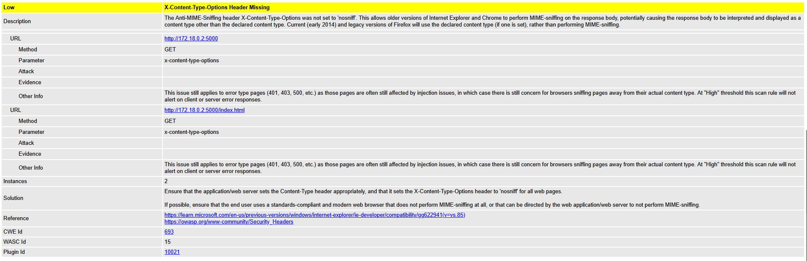

CSA Realiza uma análise de segurança e qualidade de código feito em .NET. 

Está pipeline  é dividida em várias etapas organizadas logicamente para validar o projeto a cada, pull request. Passando a ser validado por algum membro da equipa.

Depois a mesma faz analise pelo Snyk, onde varre o codigo-fonte com SAST, fazendo uma analise estatica. 

Logo em seguida utiliza o recurso do SonarCloud para ver a qualidade do codigo e bugs existentes. 

Depois com o Owasp fazem uma analise Dinamica(DAST), onde vai testar diretamente os endpoints.

Logo abaixo obtemos o relatorio com as informações geradas desta pipeline.

**Relatorio Zap do CSA.**

**Alert e Vunerabilidades .**

Neste Relatorio indentificamos tres tipos de alertas, com suas serveridades dentro da escala de riscos, High, Medium e Low.
Tais eles são: 

**Content Security Policy (CSP)**
é uma camada adicional de segurança que ajuda a detectar e mitigar certos tipos de ataques, incluindo Cross Site Scripting (XSS) e ataques de injeção de dados. Esses ataques são usados para tudo, desde roubo de dados até desfiguração ou distribuição de malware no site.

**Missing Anti-clickjacking Header**
Está falha permite o ataque ClickJacking, sendo assim uma escala media, dentro da analise de risco. Essa tecnica é usada para roubar informações, onde um site malicioso, carrega outro site legitimo dentro de um iframe invisivel, onde consegue roubar informações, inseridas pelo utilizdor.

**X-Content-Type-Options Header Missing**
O cabeçalho Anti-MIME-Sniffing X-Content-Type-Options não foi definido como 'nosniff'. Isso permite que versões mais antigas do Internet Explorer e do Chrome executem o MIME-sniffing no corpo de resposta, potencialmente fazendo com que o corpo de resposta seja interpretado e exibido como um tipo de conteúdo diferente do tipo de conteúdo declarado.
Resultado: o atacante pode executar XSS, redirecionamentos, roubo de cookies, 

