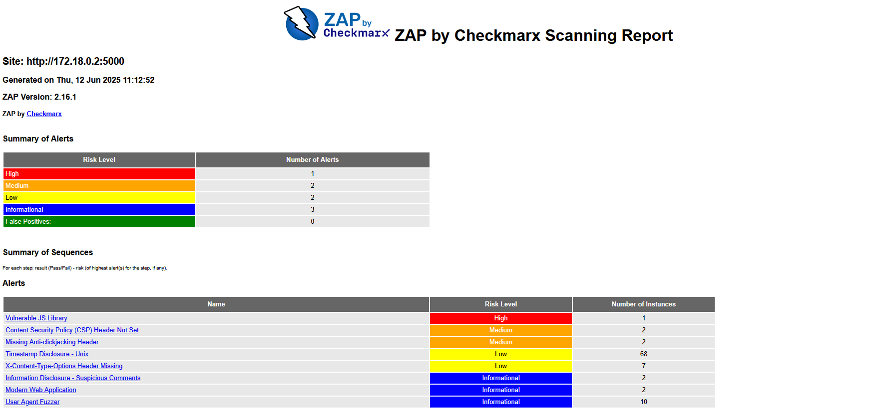
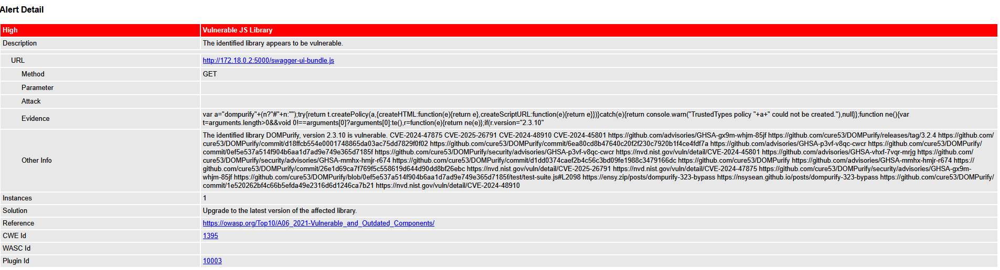
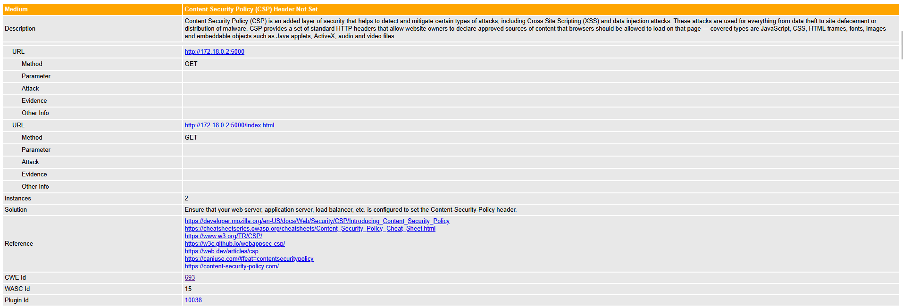
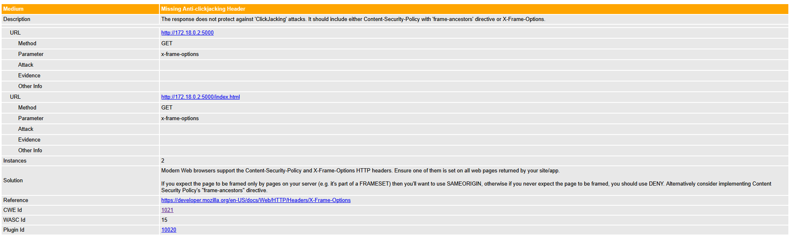
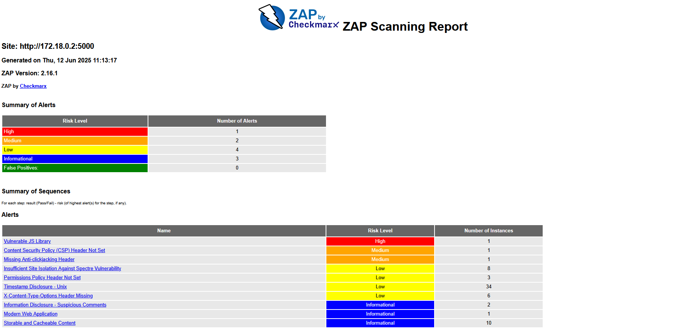
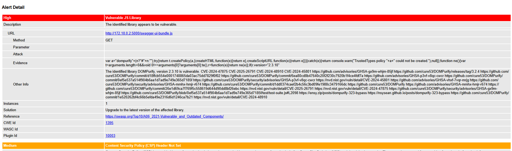
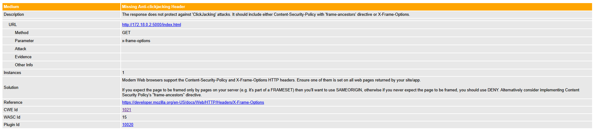

### **Metodologia DAST- Teste Dinâmico de Segurança de Aplicações**

Adota uma abordagem de segurança com o sistema em execução, ou seja, a aplicação permanece ativa durante a execução dos testes. Seu principal objetivo é identificar vulnerabilidades de segurança em tempo real, simulando ataques externos, sem acesso ao código-fonte. A estratégia utilizada envolve o envio de múltiplos tipos de requisições a diferentes endpoints, simulando ataques reais como SQL Injection, Cross-Site Scripting (XSS), CSP bypass, entre outros. Essa abordagem permite avaliar a robustez da aplicação frente a ameaças externas, de forma semelhante ao que ocorreria em um ambiente de produção.

**Objetivos**

Identificar vulnerabilidades em runtime simulando ataques reais (XSS, SQLi, CSP bypass).

**Abordagem**

 - Teste black-box (sem acesso ao código-fonte)
 - VArredura Atutomatizada + validação manual
 - Foco em Owasp top 10

**Ferramentas comuns de DAST:**

* OWASP ZAP

* Burp Suite (modo scanner)

* Acunetix

* Netsparker

Destas ferramentas acima citadas, iremos utilizar Owasp Zap.

## **Estrutura DAST-ZAP**

Aqui iremos descrever de forma simples, porem objetiva de como está criada a estrutrua do nosso DAST.

```
┌─────────────────────────────────────────────┐ 
│              Gatilhos (on)                  │
│  • Pull Request (PR)                        │
│  • workflow_dispatch (execução manual)      │
└─────────────────────┬───────────────────────┘
                      │
                      ▼
┌─────────────────────────────────────────────┐ 
│             Job: dast-zap                   │
│       (executa somente em PR)               │
│                                             │
│ Ambiente: ubuntu-latest                     │
│ Timeout: 30 minutos                         │
└─────────────────────┬───────────────────────┘
                      │
                      ▼
┌─────────────────────────────────────────────┐
│                  Steps                      │
├─────────────────────────────────────────────┤
│  1. Checkout Code                           │
│     └─ Baixa o código do repositório        │
│                                             │
│  2. Setup .NET SDK                          │
│     └─ Configura ambiente .NET 8.0          │
│                                             │
│  3. Build Docker Image                      │
│     ├─ Constrói imagem da API               │
│     └─ Tag: dast-api-test                   │
│                                             │
│  4. Create Docker Network                   │
│     └─ Rede: dast-network                   │
│                                             │
│  5. Run API Container                       │
│     ├─ Container: dast-api                  │
│     ├─ Porta: 8080:8080                     │
│     └─ Rede: dast-network                   │
│                                             │
│  6. Wait & Inspect API                      │
│     ├─ Aguarda 30 segundos                  │
│     ├─ Verifica status do container         │
│     └─ Exibe logs da API                    │
│                                             │
│  7. Test API Connectivity                   │
│     ├─ Testa endpoint /health               │
│     └─ Valida resposta da API               │
│                                             │
│  8. Run ZAP Security Scan                   │
│     ├─ Gera configuração do ZAP             │
│     ├─ Executa zap.sh baseline              │
│     ├─ Target: http://dast-api:8080         │
│     ├─ Timeout: 10 minutos                  │
│     └─ Fallback em caso de falha            │
│                                             │
│  9. Check & Process Reports                 │
│     ├─ Verifica arquivos gerados            │
│     ├─ Exibe resumo dos resultados          │
│     └─ Valida formato dos relatórios        │
│                                             │
│ 10. Upload Security Artifacts               │
│     ├─ HTML Report                          │
│     ├─ JSON Report                          │
│     ├─ XML Report                           │
│     └─ Container Logs                       │
│                                             │
│ 11. Error Handling                          │
│     ├─ Em caso de falha: exibe logs         │
│     ├─ Captura estado dos containers        │
│     └─ Debug de conectividade               │
│                                             │
│ 12. Cleanup Resources                       │
│     ├─ Para e remove containers             │
│     ├─ Remove rede Docker                   │
│     └─ Limpa recursos temporários           │
└─────────────────────────────────────────────┘

┌─────────────────────────────────────────────┐
│              Outputs/Artefatos              │
├─────────────────────────────────────────────┤
│ • ZAP HTML Report (relatório visual)        │
│ • ZAP JSON Report (dados estruturados)      │
│ • ZAP XML Report (formato padrão)           │
│ • Container Logs (debug/troubleshooting)    │
│ • Security Summary (resumo executivo)       │
└─────────────────────────────────────────────┘
```
**Secção Codigo-Fonte**

Apos apresentarmos a estrutura dos processos executados pelo DAST, iremos agora, revelar o codigo em si.

```
name: DAST (OWASP ZAP)

on:
  push:
    branches: ["**"]
  pull_request:
    branches: ["**"]
  workflow_dispatch:

env:
  DOCKER_IMAGE_NAME: library-api
  API_PORT: 5000
  PROJECT_DIR: ./LibraryOnlineRentalSystem

jobs:
  dast-zap:
    runs-on: ubuntu-latest
    if: github.event_name == 'pull_request' && success()
    timeout-minutes: 20

    steps:
      - name: Checkout Code
        uses: actions/checkout@v4

      - name: Setup .NET
        uses: actions/setup-dotnet@v3
        with:
          dotnet-version: '8.0.x'

      - name: Build Docker Image
        working-directory: ${{ env.PROJECT_DIR }}
        run: docker build -t $DOCKER_IMAGE_NAME .

      - name: Create Docker Network
        run: docker network create zap-net

      - name: Run API Container
        run: |
          # First, let's try to determine what port the API actually uses
          echo "Building and starting API container..."
          
          docker run -d \
            --name api \
            --network zap-net \
            -p ${{ env.API_PORT }}:${{ env.API_PORT }} \
            -e ASPNETCORE_URLS=http://+:${{ env.API_PORT }} \
            -e ASPNETCORE_ENVIRONMENT=Development \
            ${{ env.DOCKER_IMAGE_NAME }}
          
          echo "Container started, checking status..."
          docker ps | grep api

      - name: Wait for API to be ready and get network info
        run: |
          echo "Waiting for API to start..."
          sleep 15
          
          # Get container network information
          API_IP=$(docker inspect -f '{{range.NetworkSettings.Networks}}{{.IPAddress}}{{end}}' api)
          echo "API Container IP: $API_IP"
          
          # Show container status
          docker ps | grep api
          docker logs api --tail 20
          
          # Test network connectivity
          echo "Testing network connectivity..."
          docker run --rm --network zap-net alpine:latest ping -c 3 $API_IP || echo "Ping failed"

      - name: Test API connectivity with retries
        run: |
          API_IP=$(docker inspect -f '{{range.NetworkSettings.Networks}}{{.IPAddress}}{{end}}' api)
          echo "Testing API connectivity at: http://$API_IP:${{ env.API_PORT }}"
          
          # Try multiple endpoints and methods
          for endpoint in "" "/" "/health" "/swagger"; do
            echo "Testing endpoint: $endpoint"
            docker run --rm --network zap-net curlimages/curl:latest \
              curl -v --connect-timeout 10 --max-time 30 \
              http://$API_IP:${{ env.API_PORT }}$endpoint || echo "Failed to connect to $endpoint"
          done
          
          # Final connectivity test with detailed output
          echo "Final connectivity test..."
          docker run --rm --network zap-net curlimages/curl:latest \
            curl -I --connect-timeout 10 --max-time 30 \
            http://$API_IP:${{ env.API_PORT }} && echo "API is accessible!" || echo "API is not accessible"

      - name: Run OWASP ZAP Scan with enhanced configuration
        run: |
          API_IP=$(docker inspect -f '{{range.NetworkSettings.Networks}}{{.IPAddress}}{{end}}' api)
          echo "Starting ZAP scan against API at: http://$API_IP:${{ env.API_PORT }}"
          
          mkdir -p zap-work
          chmod -R 777 zap-work
          
          # Create a ZAP automation configuration file
          cat > zap-work/automation.yaml << 'EOF'
          env:
            contexts:
              - name: "Default"
                urls: ["http://TARGET_URL:TARGET_PORT"]
                includePaths: 
                  - "http://TARGET_URL:TARGET_PORT/.*"
                excludePaths: []
            parameters:
              failOnError: false
              failOnWarning: false
              progressToStdout: true
          
          jobs:
            - type: spider
              parameters:
                context: "Default"
                url: "http://TARGET_URL:TARGET_PORT"
                maxDuration: 5
                maxDepth: 5
                numberOfThreads: 5
                delayInMs: 0
                acceptCookies: true
                handleODataParametersVisited: false
                handleParameters: "USE_ALL"
                maxParseSizeBytes: 2621440
                parseComments: true
                parseGit: false
                parseRobotsTxt: true
                parseSitemapXml: true
                parseSVNEntries: false
                postForm: true
                processForm: true
                requestWaitTime: 200
                sendRefererHeader: true
                threadCount: 2
            
            - type: activeScan  
              parameters:
                context: "Default"
                policy: "Default Policy"
                maxDuration: 10
                maxRuleDurationInMins: 0
                maxScanDurationInMins: 0
                addQueryParam: false
                defaultPolicy: "Default Policy"
                delayInMs: 0
                handleAntiCSRFTokens: false
                hostPerScan: 0
                inScopeOnly: true
                maxAlertsPerRule: 10
                maxBodySizeInBytesToScan: 10000
                maxResultsToScan: 0
                threadPerHost: 2
          
            - type: report
              parameters:
                template: "traditional-json"
                reportDir: "/zap/wrk"
                reportFile: "report_json.json"
              risks:
                - high
                - medium
                - low
                - info
          
            - type: report
              parameters:
                template: "traditional-html"
                reportDir: "/zap/wrk"
                reportFile: "report_html.html"
              risks:
                - high
                - medium
                - low
                - info
          
            - type: report
              parameters:
                template: "traditional-md"
                reportDir: "/zap/wrk"
                reportFile: "report_md.md"
              risks:
                - high
                - medium
                - low
                - info
          EOF
          
          # Replace placeholders in the config
          sed -i "s/TARGET_URL/$API_IP/g" zap-work/automation.yaml
          sed -i "s/TARGET_PORT/${{ env.API_PORT }}/g" zap-work/automation.yaml
          
          # Run ZAP with the automation file
          docker run --rm \
            --network zap-net \
            -v ${{ github.workspace }}/zap-work:/zap/wrk/:rw \
            ghcr.io/zaproxy/zaproxy:stable \
            zap.sh -cmd -autorun /zap/wrk/automation.yaml || {
              echo "ZAP automation failed, trying baseline scan..."
              docker run --rm \
                --network zap-net \
                -v ${{ github.workspace }}/zap-work:/zap/wrk/:rw \
                ghcr.io/zaproxy/zaproxy:stable \
                zap-baseline.py \
                -t http://$API_IP:${{ env.API_PORT }} \
                -J /zap/wrk/report_json_baseline.json \
                -w /zap/wrk/report_md_baseline.md \
                -r /zap/wrk/report_html_baseline.html \
                -I -d --hook=/zap/auth_hook.py || echo "Both ZAP scans failed, but continuing..."
            }

      - name: Check ZAP Reports
        run: |
          echo "Checking generated reports..."
          ls -la zap-work/
          if [ -f "zap-work/report_json.json" ]; then
            echo "JSON report generated successfully"
          else
            echo "JSON report not found"
          fi

      - name: Upload ZAP Report
        uses: actions/upload-artifact@v4
        if: always()
        with:
          name: zap-report
          path: zap-work/

      - name: Display API Logs (if scan failed)
        if: failure()
        run: |
          echo "=== API Container Logs ==="
          docker logs api

      - name: Stop and Remove API Container
        if: always()
        run: |
          docker stop api || true
          docker rm api || true
          docker network rm zap-net || true

```

Abaixo descreveremos os resultados desta pipeline a corre, com as informações dos alertas e vulnerabilidades.

## **Reports** 
Apos analise da pipeline a mesma vai gerar dois tipos de relatorios, com base na varredura do ZAP são eles: 
* Passivo
* Profundidade


## **ZAP Passivo**
Abaixo disponibilizamos os resultados consolidados de cada relatório, contendo:

Total de alertas identificados: [5]

Nível de criticidade:

🟠 Alto: [1]

🟡 Médio: [2]

🔵 Baixo: [2]

Descrição do relatório:

✅ Descrição completa dos alertas

✅ Classificação de risco (CVSS)

✅ CVEs associados (com links para bases oficiais)

✅ Evidências técnicas (trechos de código/requisições)

✅ Recomendações de correção

 
 
 
 


 ## **ZAP Profundidade**
Abaixo disponibilizamos os resultados consolidados de cada relatório, contendo:

Total de alertas identificados: [7]

Nível de criticidade:

🟠 Alto: [1]

🟡 Médio: [2]

🔵 Baixo: [4]

Descrição do relatório:

✅ Descrição completa dos alertas

✅ Classificação de risco (CVSS)

✅ CVEs associados (com links para bases oficiais)

✅ Evidências técnicas (trechos de código/requisições)

✅ Recomendações de correção

 
 
 
 


 ## **Report Completo:**

 🔗 [Reports Passivo](./Deliverables/Phase%202%20-%20Sprint%202/Documentation/Pipeline/DAST/report_md.md)

 🔗 [Reports Profundidade](./Deliverables/Phase%202%20-%20Sprint%202/Documentation/Pipeline/DAST/report__baseline.md)

 

| Métrica          | Passivo | Ativo |
|:-----------------|--------:|:-----:|
| Total de Alertas |       5 |   7   |
| Crítico          |       0 |   0   |
| Alto (CVE-2024-XXXX) |       1 |   1   |
| Médio            |       2 |   2   |

## **Resumo da Análise DAST**  
- **Aplicação Testada:** API .NET 8 (Porta 5000)  
- **Vulnerabilidade Crítica:** 0  
- **Alerta Mais Grave:** [CVE-2024-47875] XSS em DOMPurify (CVSS 8.1)  
- **Recomendação Imediata:** Atualizar bibliotecas JavaScript  