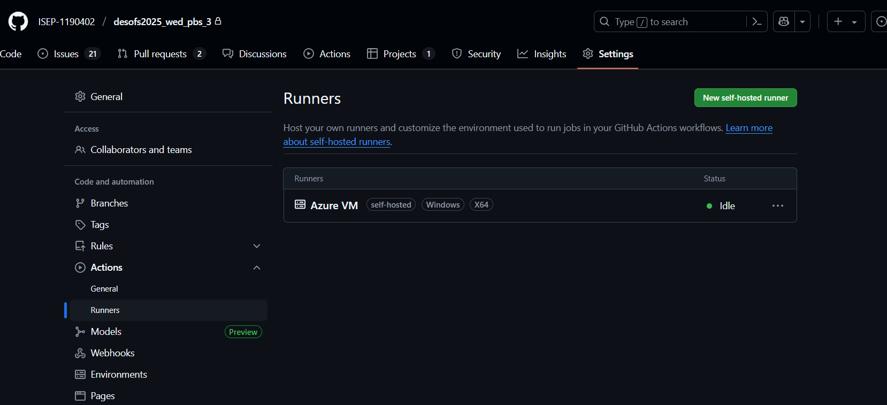

# Deploy Pipeline

To carry out the deployment, a few steps were taken, such as configuring IIS and the github runner to enable the deployment, as described here:
[Infrastructure.md](../../Infrastructure/Infrastructure.md)

[Pipeline Code](https://github.com/ISEP-1190402/desofs2025_wed_pbs_3/blob/main/.github/workflows/deploytovmiis.yml)
---

## Pipeline Explanation

This pipeline automates the process of building and deploying a .NET application to an IIS server, using GitHub Actions to streamline both continuous integration and deployment. Below is a structured breakdown of its components and workflow.

Workflow Triggers
Manual Trigger: Allows manual execution via workflow_dispatch.

Push Trigger: Runs automatically on pushes to the main branch.

Environment Variables
WORKING_DIRECTORY: Specifies the solution folder.

DOTNET_VERSION: Ensures the correct .NET SDK version is used.

Jobs Overview
1. Build Job
   Runner: Executes on windows-latest.

Permissions: Minimal, just enough for code checkout.

Steps:

* Checkout: Retrieves the repository code.
* Setup .NET: Installs .NET 8.x SDK.
* Build: Compiles the project in Release mode.
* Publish: Outputs the published app to a temporary folder.
* Upload Artefact: Makes the published output available for the deploy job.

2. Deploy Job
   Runner: Runs on a self-hosted Windows machine (the IIS server).

Dependency: Waits for the build job to complete.

Steps:

* Download Artefact: Retrieves the published app.
* Debug Listing: Lists artefact files for troubleshooting.
* Deploy to IIS: Removes old files from the IIS folder and copies in the new build.

