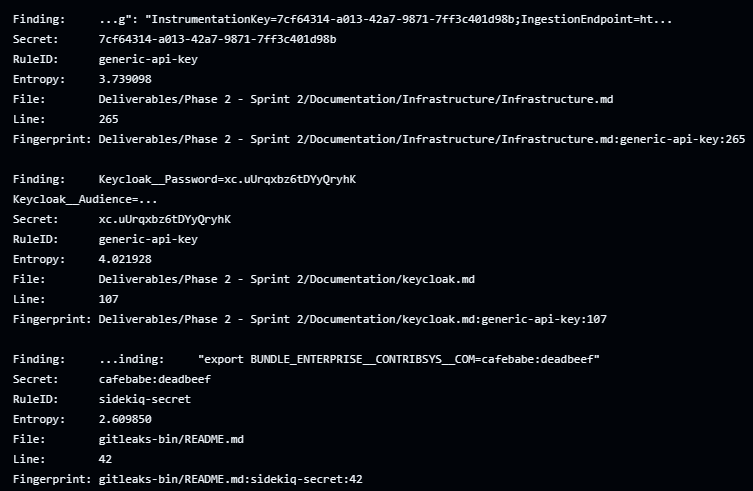
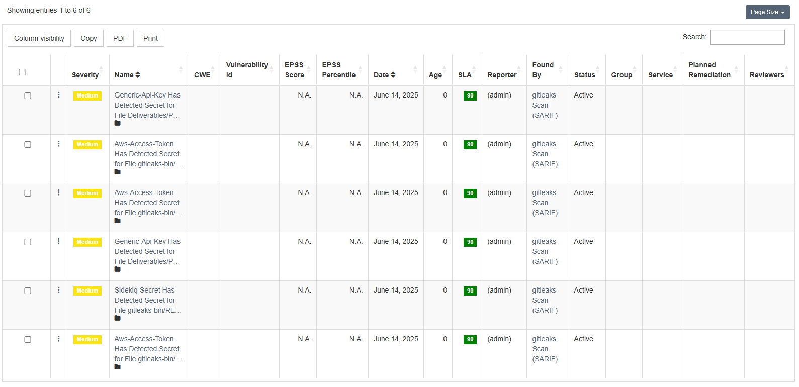

# Gitleaks Secret Scanning CI Setup

This project uses [Gitleaks](https://github.com/gitleaks/gitleaks) to automatically scan the codebase for hardcoded secrets (e.g., API keys, passwords) on every push and pull request only to main and development branches.

## File Location

The GitHub Actions workflow is defined in: [GitleaksURL](https://github.com/ISEP-1190402/desofs2025_wed_pbs_3/blob/main/.github/workflows/gitleaks.yml).

## How It Works

- On every `push` or `pull_request` to the main and development branches, the workflow:
  1. Checks out the latest code.
  2. Downloads and extracts the Gitleaks v8.18.2 binary.
  3. Runs Gitleaks to scan the current working directory for secrets.
  4. Outputs a SARIF report (`gitleaks-sarif-report`) but **does not fail the pipeline** if secrets are found.

## Why We Use It

- Prevents accidental leaks of credentials in the repository.
- Encourages secure development practices.
- Works silently: the workflow continues even if secrets are found.

## Configuration Details

- **Tool:** Gitleaks v8.18.2
- **Scan Scope:** Current working directory
- **Exits Gracefully:** Always exits successfully using `|| true`
- **Manual Trigger:** Also supports manual runs via `workflow_dispatch`.

## Sample Output

Detected secrets will be listed in the GitHub Actions logs. Example output:

## Notes

- The binary is extracted locally to `gitleaks-bin/` and excluded from future scans.
- This setup is **non-blocking** (does not fail the build).

---

## Manually Importing Gitleaks Scan Results into DefectDojo

We manually uploaded the SARIF report to  [DefectDojo](https://github.com/DefectDojo/django-DefectDojo) to manage our security findings and also for tracking and triaging.

### Steps:

1. **Log into your DefectDojo instance**  
   e.g. `https://demo.defectdojo.org` (username: `admin`, password: `1Defectdojo@demo#appsec`)

2. **Create a Product**
   - Go to **Products** → **Add Product**
   - Set a product name like `MyProject`
   - Choose or create a product type
   - Submit

3. **Create an Engagement**
   - Go to **Engagements** → **Add Engagement**
   - Link it to your product
   - Set a name like `Gitleaks - June Scan`
   - Set type: `CI/CD` or `Interactive`
   - Set start and end dates
   - Submit

4. **Import the Gitleaks SARIF Report**
   - Open the engagement you just created
   - Click **“Import Scan Results”**
   - Choose **Scan Type**: `SARIF`
   - Upload `gitleaks-report.sarif`
   - Click **Submit**

5. **Review Findings**
   - Go to **Findings** tab under the engagement
   - You can assign, triage, or comment on findings

---

