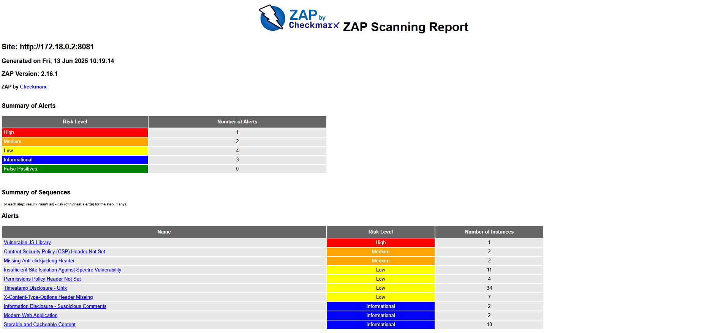
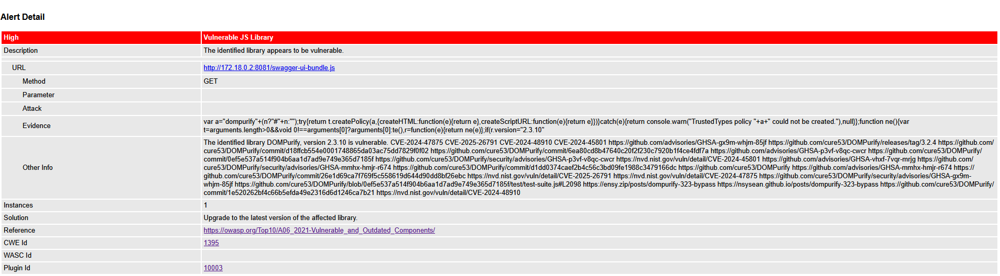
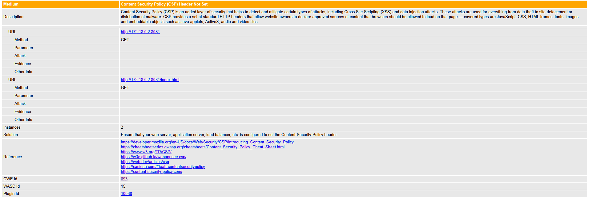
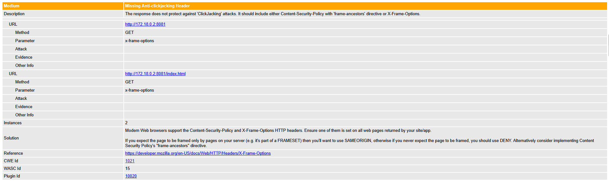

### **Metodologia IAST- Teste Interativo de Segurança de Aplicações**


**Objetivos**

Identificar vulneralidades reais durante a execução da aplicação, alem de combinar o SAST(codigo) e DAST(execução), contudo reduzir falsos positivos e proteger aplicação em tempo de teste. O mesmo só é executado quando for realizdo o pull_request e houver aprovação de algum membro da equipa.

**Abordagem**

Executar o SAST com Snyk(codigo e deps), contudo contruir e executar API em Docker. Correr a DAST com ZAP Proxy, simular interativa de ataque e analise, alem de fazer o uploads e gerar os relatórios

 
**Ferramentas comuns de IAST:**
* Snyk
* OWASP ZAP
* Contrast IAST
* Seeker (Synopsys)
* HCL AppScan IAST


Destas ferramentas acima citadas, iremos utilizar Snyk e Owasp Zap, para combinar um tecnologias onde irá aproximar-se do resultado do IAST, haja vista que as ferramentas direcionadas ao IAST, são elas pagas.

⚠️ Observação
Ferramentas como Snyk e ZAP não são IAST puros, mas sua integração em pipelines permite simular um fluxo IAST.

## **Estrutura IAST**

Aqui iremos descrever de forma simples, porem objetiva de como está criada a estrutrua do nosso IAST.

```
┌─────────────────────────────────────────────┐ 
│              Gatilhos (on)                  │
│  • push → branch "main"                     │
│  • pull_request → todas as branches         │
│  • workflow_dispatch (execução manual)      │
└─────────────────────┬───────────────────────┘
                      │
                      ▼
┌─────────────────────────────────────────────┐ 
│             Job: iast-security              │
│       (executa somente em PR + success)     │
│                                             │
│ Ambiente: ubuntu-latest                     │
│ Timeout: 25 minutos                         │
└─────────────────────┬───────────────────────┘
                      │
                      ▼
┌─────────────────────────────────────────────┐
│                  Etapas                     │
├─────────────────────────────────────────────┤
│  0. Auto-aprovação condicional              │
│     └─ Aprova PR se segurança passar        │
│                                             │
│  1. Checkout Code                           │
│     └─ actions/checkout@v4                  │
│                                             │
│  2. Setup .NET 8.0                          │
│     └─ actions/setup-dotnet@v3              │
│                                             │
│  3. SAST: Snyk Dependency Scan              │
│     ├─ Verifica vulnerabilidades            │
│     └─ Gera SARIF (snyk-deps.sarif)         │
│                                             │
│  4. SAST: Snyk Code Analysis                │
│     ├─ Análise estática de código           │
│     └─ Gera SARIF (snyk-code.sarif)         │
│                                             │
│  5. Build Docker Image                      │
│     ├─ Tag: library-api                     │
│     └─ Diretório:./LibraryOnlineRentalSystem│
│                                             │
│  6. Cria Rede Docker                        │
│     └─ zap-net                              │
│                                             │
│  7. Deploy API Container                    │
│     ├─ Nome: api                            │
│     ├─ Porta: 8081                          │
│     ├─ Health Check (30 tentativas)         │
│     └─ Fallback: exibe logs                 │
│                                             │
│  8. DAST: OWASP ZAP Scan                    │
│     ├─ Modo: baseline                       │
│     ├─ Formatos: HTML/JSON/MD               │
│     ├─ Rede: zap-net                        │
│     └─ Timeout: 10 minutos                  │
│                                             │
│  9. Upload Artefatos                        │
│     ├─ Relatórios Snyk (SARIF)              │
│     ├─ Relatórios ZAP (3 formatos)          │
│     └─ Logs do container                    │
│                                             │
│ 10. Cleanup                                 │
│     ├─ Para container da API                │
│     └─ Remove rede Docker                   │
└─────────────────────────────────────────────┘

┌─────────────────────────────────────────────┐
│           Outputs/Artefatos                 │
├─────────────────────────────────────────────┤
│ • Snyk Dependency Report (SARIF)            │
│ • Snyk Code Report (SARIF)                  │
│ • ZAP HTML Report (interativo)              │
│ • ZAP JSON Report (máquina)                 │
│ • ZAP Markdown Report (legível)             │
│ • API Container Logs (debug)                │
└─────────────────────────────────────────────┘

┌─────────────────────────────────────────────┐
│         Diferenciais IAST                   │
├─────────────────────────────────────────────┤
│ • Combina SAST + DAST num único fluxo       │
│ • Auto-aprovação condicional de PRs         │
│ • Health Check inteligente da API           │
│ • Rede isolada para escaneamento            │
│ • Relatórios multi-formato                  │
│ • Cleanup automático                        │
└─────────────────────────────────────────────┘

```
**Secção Codigo-Fonte**

Apos apresentarmos a estrutura dos processos executados pelo IAST, iremos agora, revelar o codigo em si.

```
name: Full_Security_IAST (SAST + DAST = Simulador IAST)

on:
  push:
    branches: ["main"]
  pull_request:
    branches: ["**"]
  workflow_dispatch:

env:
  DOCKER_IMAGE_NAME: library-api
  API_PORT: 8081

jobs:
  iast-security:
    runs-on: ubuntu-latest
    if: github.event_name == 'pull_request' && success()
    timeout-minutes: 25

    steps:
    # 0. Aprovar Pull_request 
    - name: iAuto-approve if security passed
      uses: hmarr/auto-approve-action@v3
      with:
        github-token: ${{ secrets.GITHUB_TOKEN }}

    # 1. Checkout código
    - name: Checkout repository
      uses: actions/checkout@v4

    # 2. Setup .NET
    - name: Setup .NET
      uses: actions/setup-dotnet@v3
      with:
        dotnet-version: '8.0.x'

    # 3. Restaurar dependências
    - name: Restore dependencies
      run: dotnet restore ./LibraryOnlineRentalSystem/LibraryOnlineRentalSystem.csproj

    # 4. Instalar Snyk CLI
    - name: Install Snyk CLI
      run: npm install -g snyk@latest

    # 5. Rodar Snyk (SAST + Deps) e exportar SARIF
    - name: Run Snyk Scans
      working-directory: ./LibraryOnlineRentalSystem
      env:
        SNYK_TOKEN: ${{ secrets.SNYK_TOKEN }}
        SONAR_TOKEN: ${{ secrets.SONAR_TOKEN }}
      run: |
        mkdir -p ./snyk_results
        snyk test --file=LibraryOnlineRentalSystem.csproj --all-projects --sarif-file-output=./snyk_results/snyk-deps.sarif || true
        snyk code test --severity-threshold=high --sarif-file-output=./snyk_results/snyk-code.sarif || true
        ls -la ./snyk_results/

    - name: Upload Snyk SARIF
      uses: actions/upload-artifact@v4
      with:
        name: snyk-sarif-results
        path: |
          ./LibraryOnlineRentalSystem/snyk_results/snyk-deps.sarif
          ./LibraryOnlineRentalSystem/snyk_results/snyk-code.sarif

    # 5. Build imagem Docker
    - name: Build Docker Image
      working-directory: ./LibraryOnlineRentalSystem
      run: docker build -t $DOCKER_IMAGE_NAME .

    - name: Create Docker Network
      run: docker network create zap-net

    # 6. Prepara API no container
    - name: Run API Container
      run: |
        docker run -d \
          --name api \
          --network zap-net \
          -p $API_PORT:$API_PORT \
          -e ASPNETCORE_URLS=http://+:$API_PORT \
          $DOCKER_IMAGE_NAME
        
        # Aguardar a API inicializar
        echo "Aguardando API inicializar..."
        for i in {1..30}; do
          API_IP=$(docker inspect -f '{{range.NetworkSettings.Networks}}{{.IPAddress}}{{end}}' api)
          if curl -s -f http://$API_IP:$API_PORT/health > /dev/null 2>&1 || \
             curl -s -f http://$API_IP:$API_PORT > /dev/null 2>&1; then
            echo "API está respondendo!"
            break
          fi
          echo "Tentativa $i/30 - API ainda não está pronta..."
          sleep 10
        done
        
        # Verificar logs se ainda não estiver funcionando
        echo "Logs do container API:"
        docker logs api

    # 7. ZAP Scan
    - name: Run OWASP ZAP Scan
      run: |
        API_IP=$(docker inspect -f '{{range.NetworkSettings.Networks}}{{.IPAddress}}{{end}}' api)
        echo "API container IP: $API_IP"
        echo "Testando conectividade com a API..."
        
        # Teste de conectividade
        if ! curl -s -f http://$API_IP:${{ env.API_PORT }} > /dev/null 2>&1; then
          echo "ERRO: Não foi possível conectar à API em http://$API_IP:${{ env.API_PORT }}"
          echo "Logs do container:"
          docker logs api
          exit 1
        fi
        
        mkdir -p $GITHUB_WORKSPACE/zap-work
        chmod -R 777 $GITHUB_WORKSPACE/zap-work
        
        docker run --rm \
          --network zap-net \
          -v $GITHUB_WORKSPACE/zap-work:/zap/wrk:rw \
          ghcr.io/zaproxy/zaproxy:stable \
          zap-baseline.py \
          -t http://$API_IP:${{ env.API_PORT }} \
          -J report_json.json \
          -w report_md.md \
          -r report_html.html \
          -I

    # 8. Upload dos arquivos gerados OWASP ZAP
    - name: Upload ZAP Reports
      uses: actions/upload-artifact@v4
      if: always()
      with:
        name: zap-reports_iast
        path: zap-work/
      
    # 9. Stop Container  
    - name: Stop API Container
      if: always()
      run: |
        docker stop api || true
        docker rm api || true
        docker network rm zap-net || true

```

Abaixo descreveremos os resultados desta pipeline a correr, com as informações dos alertas e vulnerabilidades.

## **Reports** 


Abaixo disponibilizamos os resultados consolidados de cada relatório, contendo:

Total de alertas identificados: [5]

Nível de criticidade:

🟠 Alto: [1]

🟡 Médio: [2]

🔵 Baixo: [2]

Descrição do relatório:

✅ Descrição completa dos alertas

✅ Classificação de risco (CVSS)

✅ CVEs associados (com links para bases oficiais)

✅ Evidências técnicas (trechos de código/requisições)

✅ Recomendações de correção

 
 
 
 


 
 ## **Report Completo:**

 🔗 [Reports Passivo](./Deliverables/Phase%202%20-%20Sprint%202/Documentation/Pipeline/DAST/report_md.md)

 🔗 [Reports Profundidade](./Deliverables/Phase%202%20-%20Sprint%202/Documentation/Pipeline/DAST/report__baseline.md)

 

| Métrica          | Passivo | Ativo |
|:-----------------|--------:|:-----:|
| Total de Alertas |       5 |   7   |
| Crítico          |       0 |   0   |
| Alto (CVE-2024-XXXX) |       1 |   1   |
| Médio            |       2 |   2   |

## **Resumo da Análise IAST**  
- **Aplicação Testada:** API .NET 8 (Porta 5000)  
- **Vulnerabilidade Crítica:** 0  
- **Alerta Mais Grave:** [CVE-2024-47875] XSS em DOMPurify (CVSS 8.1)  
- **Recomendação Imediata:** Atualizar bibliotecas JavaScript  