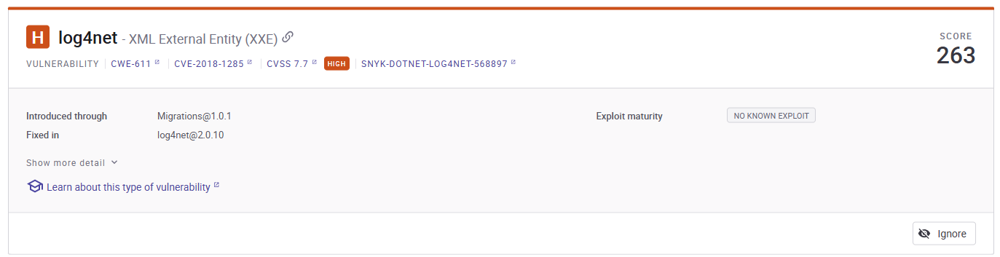
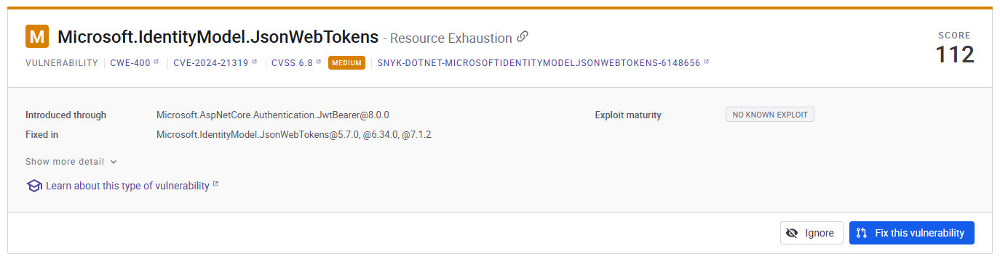
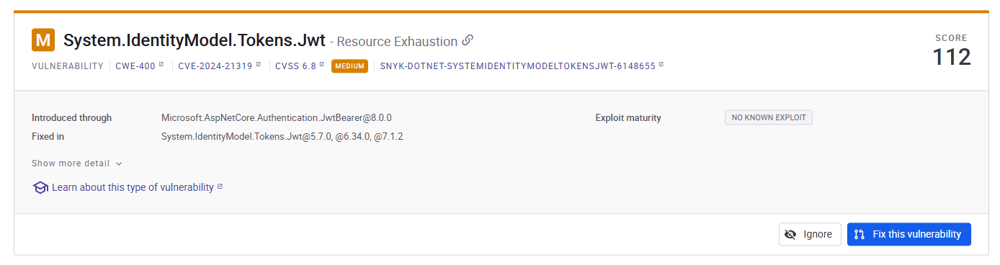
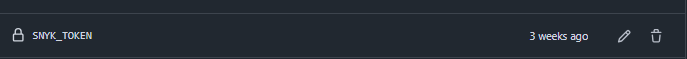

### **Metodologia SAST- Teste Estatico de Segurança de Aplicações**
Aborda uma tecninca de segurança que analisa, o codigo-fonte da app( bytecode/binario), contudo sem executalo, pois segue em busca de vuçnerabilidade. Podemos dizer que é como fazer uma auditoria por dentro olhando o codigo em si.


**Objetivos**

Identficar e corrigir vulnerabilidades de segurança no codigo-fonte da app, ainda no seu ciclo de desenvolvimento. A mesma arranca a cada pull requests usando o Snyk e gerar relatorios para avalição de vulnerabilidades no codigo e nas dependecias. 


**Abordagem**
- Aceasar o Codigo-Fonte
- análise com Snyk ( Snyk Code e Dependency Scan)
- Gerar relatorios da vulnerabilidade e dependecias
- Upload dos resultados


**Ferramentas  SAST:**
* GitHub Actions
* Snyk CLI
* Node.js
* upload-sarif
* upload-artifact

Descrevemos quais tipos de ferramentas, que utilizamos para correr estes os processos na pipeline.

## **Estrutura SAST**

Aqui iremos descrever de forma simples, porem objetiva de como está criada a estrutrua do nosso DAST.

```
┌─────────────────────────────────────────────┐ 
│               Gatilhos (on)                 │
│  • Pull Request (PR)                        │
│  • Push (qualquer branch)                   │
└─────────────────────┬───────────────────────┘
                      │
                      ▼
┌─────────────────────────────────────────────┐ 
│         Job: sast-scan (Snyk SAST)          │
│     (executa somente em pull_request)       │
│                                             │
│ Ambiente: ubuntu-latest                     │
│ Condição: success()                         │
└─────────────────────┬───────────────────────┘
                      │
                      ▼
┌─────────────────────────────────────────────┐
│                  Steps                      │
├─────────────────────────────────────────────┤
│  1. Checkout Repository                     │
│     └─ Usa actions/checkout@v4              │
│     └─ Caminho: ./src                       │
│                                             │
│  2. Setup Node.js                           │
│     └─ Usa actions/setup-node@v4            │
│     └─ Node.js v18                          │
│                                             │
│  3. Install Snyk CLI                        │
│     └─ npm install -g snyk@latest           │
│                                             │
│  4. Create Results Directories              │
│     ├─ ./snyk_results/json                  │
│     └─ ./snyk_results/sarif                 │
│                                             │
│  5. List Directory Contents                 │
│     └─ ls -R ./src                          │
│                                             │
│  6. Run Snyk Code SAST Scan                 │
│     ├─ snyk code test --json                │
│     ├─ snyk code test --sarif-file-output   │
│     └─ Também executa test no .csproj       │
│                                             │
│  7. Run Snyk Dependency Scan (redundante)   │
│     ├─ snyk test --json / .sarif            │
│     └─ Repete análise no mesmo .csproj      │
│                                             │
│  8. Verify JSON & SARIF Files               │
│     ├─ Lista os arquivos gerados            │
│     └─ Confirma presença de relatórios      │
│                                             │
│  9. Upload Artifacts                        │
│     ├─ JSON Reports                         │
│     └─ SARIF Reports                        │
│                                             │
│ 10. Upload SARIF to GitHub Security         │
│     ├─ Envia snyk-code.sarif                │
│     └─ Categoria: snyk-code                 │
└─────────────────────────────────────────────┘

┌─────────────────────────────────────────────┐
│            Outputs / Artefatos              │
├─────────────────────────────────────────────┤
│ • snyk-code.json (SAST - JSON)              │
│ • snyk-code.sarif (SAST - GitHub)           │
│ • snyk-deps.json (Dependências - JSON)      │
│ • snyk-deps.sarif (Dependências - SARIF)    │
│ • Artefato: snyk-sast-json-reports          │
└─────────────────────────────────────────────┘   
```

**Secção Codigo-Fonte**

Apos apresentarmos a estrutura dos processos executados pelo DAST, iremos agora, revelar o codigo em si.

```
name: Snyk SAST Code and Dependency

on:
  push:
    branches: ["**"]
  pull_request:
    branches: ["**"]

jobs:
  sast-scan:
    name: SAST Snyk Code and Dependency
    runs-on: ubuntu-latest
    if: github.event_name == 'pull_request' && success()
    permissions:
      contents: read
      security-events: write
      actions: read
      id-token: write

    steps:
    - name: Checkout repository
      uses: actions/checkout@v4
      with:
        path: ./src

    - name: Setup Node.js
      uses: actions/setup-node@v4
      with:
        node-version: '18'

    - name: Install Snyk CLI
      run: |
        npm install -g snyk@latest

    - name: Create results directories
      working-directory: ./src
      run: |
        mkdir -p ./snyk_results/json
        mkdir -p ./snyk_results/sarif

    - name: List src directory contents for debugging
      run: ls -R ./src

    - name: Run Snyk Code SAST Scan
      working-directory: ./src
      env:
        SNYK_TOKEN: ${{ secrets.SNYK_TOKEN }}
      run: |
        echo "Running Snyk static code analysis..."
        snyk code test --json > ./snyk_results/json/snyk-code.json || true
        snyk code test --sarif-file-output=./snyk_results/sarif/snyk-code.sarif || true
        snyk test --file=ISEP-1190402/desofs2025_wed_pbs_3/LibraryOnlineRentalSystem/LibraryOnlineRentalSystem.csproj --json > ./snyk_results/json/snyk-deps.json || true
        snyk test --file=ISEP-1190402/desofs2025_wed_pbs_3/LibraryOnlineRentalSystem/LibraryOnlineRentalSystem.csproj --sarif-file-output=./snyk_results/sarif/snyk-deps.sarif || true

    - name: Run Snyk Open Source Dependency Scan
      working-directory: ./src
      env:
        SNYK_TOKEN: ${{ secrets.SNYK_TOKEN }}
      run: |
        echo "Running Snyk dependency scan..."
        snyk test --json > ./snyk_results/json/snyk-deps.json || true
        snyk test --sarif-file-output=./snyk_results/sarif/snyk-deps.sarif || true
        snyk test --file=ISEP-1190402/desofs2025_wed_pbs_3/LibraryOnlineRentalSystem/LibraryOnlineRentalSystem.csproj --json > ./snyk_results/json/snyk-deps.json || true
        snyk test --file=ISEP-1190402/desofs2025_wed_pbs_3/LibraryOnlineRentalSystem/LibraryOnlineRentalSystem.csproj --sarif-file-output=./snyk_results/sarif/snyk-deps.sarif || true

    - name: Verify generated JSON files
      run: |
        echo "JSON files generated:"
        ls -la ./src/snyk_results/json/
        echo "SARIF files generated:"
        ls -la ./src/snyk_results/sarif/

    - name: Upload SAST Report Artifacts
      uses: actions/upload-artifact@v4
      with:
        name: snyk-sast-json-reports
        path: |
          ./src/snyk_results/json/
          ./src/snyk_results/sarif/

    - name: Upload SARIF to GitHub Security
      uses: github/codeql-action/upload-sarif@v3
      with:
        sarif_file: ./src/snyk_results/sarif/snyk-code.sarif
        category: snyk-code
      continue-on-error: true
      if: always()
```

Abaixo descreveremos os resultados desta pipeline a corre, com as informações dos alertas e vulnerabilidades.

## **Reports** 
Apos analise da pipeline a mesma vai gerar dois tipos de relatorios, com base na varredura do ZAP são eles: 
* Passivo
* Profundidade


## **ZAP Passivo**
Abaixo disponibilizamos os resultados consolidados de cada relatório, contendo:

Total de alertas identificados: [5]

Nível de criticidade:

🟠 Alto: [1]

🟡 Médio: [2]

🔵 Baixo: [2]

Descrição do relatório:

✅ Descrição completa dos alertas

✅ Classificação de risco (CVSS)

✅ CVEs associados (com links para bases oficiais)

✅ Evidências técnicas (trechos de código/requisições)

✅ Recomendações de correção

 
 
 
 


 ## **ZAP Profundidade**
Abaixo disponibilizamos os resultados consolidados de cada relatório, contendo:

Total de alertas identificados: [7]

Nível de criticidade:

🟠 Alto: [1]

🟡 Médio: [2]

🔵 Baixo: [4]

Descrição do relatório:

✅ Descrição completa dos alertas

✅ Classificação de risco (CVSS)

✅ CVEs associados (com links para bases oficiais)

✅ Evidências técnicas (trechos de código/requisições)

✅ Recomendações de correção

 
 
 
 


 ## **Report Completo:**

 🔗 [Reports](./Deliverables/Phase%202%20-%20Sprint%202/Documentation/Pipeline/DAST/report_md.md)

 

 

| Métrica          | Passivo | Ativo |
|:-----------------|--------:|:-----:|
| Total de Alertas |       5 |   7   |
| Crítico          |       0 |   0   |
| Alto (CVE-2024-XXXX) |       1 |   1   |
| Médio            |       2 |   2   |

## **Resumo da Análise SAST**  
- **Aplicação Testada:** API .NET 8 (Porta 5000)  
- **Vulnerabilidade Crítica:** 0  
- **Alerta Mais Grave:** [CVE-2024-47875] XSS em DOMPurify (CVSS 8.1)  
- **Recomendação Imediata:** Atualizar bibliotecas JavaScript  