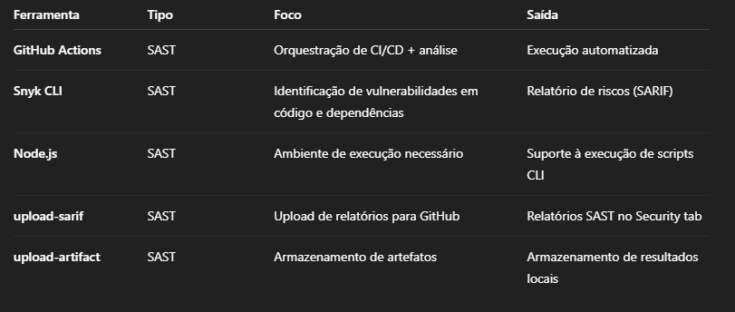
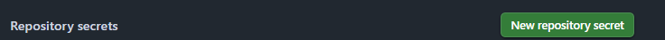
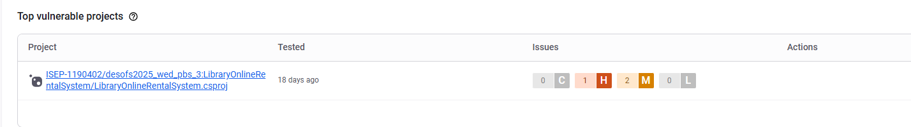

### **Metodologia SAST- Teste Estatico de Segurança de Aplicações**
Aborda uma tecninca de segurança que analisa, o codigo-fonte da app( bytecode/binario), contudo sem executalo, pois segue em busca de vuçnerabilidade. Podemos dizer que é como fazer uma auditoria por dentro olhando o codigo em si.


**Objetivos**

Identficar e corrigir vulnerabilidades de segurança no codigo-fonte da app, ainda no seu ciclo de desenvolvimento. A mesma arranca a cada pull requests usando o Snyk e gerar relatorios para avalição de vulnerabilidades no codigo e nas dependecias. 


**Abordagem**
- Aceasar o Codigo-Fonte
- análise com Snyk ( Snyk Code e Dependency Scan)
- Gerar relatorios( json e sarif)
- Upload dos resultados

**Ferramentas  SAST:**



Descrevemos quais tipos de ferramentas, que utilizamos para correr estes os processos na pipeline.

**Integração GiThub vs Snyk:**

Utilizamos o recurso de integração com a ferramenta snky para analise de vulnerabilides e depedencias, atraves do token.

Abaixo temos o token que foi gerado pelo snky e integrado junto ao Github.
Todas as vezes que fazemos um pull request, é gerado uma analise com o auxilio desta ferramenta. Por ser algo gratuito existe um limite de analises mensais.




Projeto importado do Git para o snky.



## **Estrutura SAST**

Aqui iremos descrever de forma simples, porem objetiva de como está criada a estrutrua do nosso DAST.

```
┌─────────────────────────────────────────────┐ 
│               Gatilhos (on)                 │
│  • Pull Request (PR)                        │
│  • Push (qualquer branch)                   │
└─────────────────────┬───────────────────────┘
                      │
                      ▼
┌─────────────────────────────────────────────┐ 
│         Job: sast-scan (Snyk SAST)          │
│     (executa somente em pull_request)       │
│                                             │
│ Ambiente: ubuntu-latest                     │
│ Condição: success()                         │
└─────────────────────┬───────────────────────┘
                      │
                      ▼
┌─────────────────────────────────────────────┐
│                  Steps                      │
├─────────────────────────────────────────────┤
│  1. Checkout Repository                     │
│     └─ Usa actions/checkout@v4              │
│     └─ Caminho: ./src                       │
│                                             │
│  2. Setup Node.js                           │
│     └─ Usa actions/setup-node@v4            │
│     └─ Node.js v18                          │
│                                             │
│  3. Install Snyk CLI                        │
│     └─ npm install -g snyk@latest           │
│                                             │
│  4. Create Results Directories              │
│     ├─ ./snyk_results/json                  │
│     └─ ./snyk_results/sarif                 │
│                                             │
│  5. List Directory Contents                 │
│     └─ ls -R ./src                          │
│                                             │
│  6. Run Snyk Code SAST Scan                 │
│     ├─ snyk code test --json                │
│     ├─ snyk code test --sarif-file-output   │
│     └─ Também executa test no .csproj       │
│                                             │
│  7. Run Snyk Dependency Scan (redundante)   │
│     ├─ snyk test --json / .sarif            │
│     └─ Repete análise no mesmo .csproj      │
│                                             │
│  8. Verify JSON & SARIF Files               │
│     ├─ Lista os arquivos gerados            │
│     └─ Confirma presença de relatórios      │
│                                             │
│  9. Upload Artifacts                        │
│     ├─ JSON Reports                         │
│     └─ SARIF Reports                        │
│                                             │
│ 10. Upload SARIF to GitHub Security         │
│     ├─ Envia snyk-code.sarif                │
│     └─ Categoria: snyk-code                 │
└─────────────────────────────────────────────┘

┌─────────────────────────────────────────────┐
│            Outputs / Artefatos              │
├─────────────────────────────────────────────┤
│ • snyk-code.json (SAST - JSON)              │
│ • snyk-code.sarif (SAST - GitHub)           │
│ • snyk-deps.json (Dependências - JSON)      │
│ • snyk-deps.sarif (Dependências - SARIF)    │
│ • Artefato: snyk-sast-json-reports          │
└─────────────────────────────────────────────┘   
```

**Secção Codigo-Fonte**

Apos apresentarmos a estrutura dos processos executados pelo DAST, iremos agora, revelar o codigo em si.

```
name: Snyk SAST Code and Dependency

on:
  push:
    branches: ["**"]
  pull_request:
    branches: ["**"]

jobs:
  sast-scan:
    name: SAST Snyk Code and Dependency
    runs-on: ubuntu-latest
    if: github.event_name == 'pull_request' && success()
    permissions:
      contents: read
      security-events: write
      actions: read
      id-token: write

    steps:
    - name: Checkout repository
      uses: actions/checkout@v4
      with:
        path: ./src

    - name: Setup Node.js
      uses: actions/setup-node@v4
      with:
        node-version: '18'

    - name: Install Snyk CLI
      run: |
        npm install -g snyk@latest

    - name: Create results directories
      working-directory: ./src
      run: |
        mkdir -p ./snyk_results/json
        mkdir -p ./snyk_results/sarif

    - name: List src directory contents for debugging
      run: ls -R ./src

    - name: Run Snyk Code SAST Scan
      working-directory: ./src
      env:
        SNYK_TOKEN: ${{ secrets.SNYK_TOKEN }}
      run: |
        echo "Running Snyk static code analysis..."
        snyk code test --json > ./snyk_results/json/snyk-code.json || true
        snyk code test --sarif-file-output=./snyk_results/sarif/snyk-code.sarif || true
        snyk test --file=ISEP-1190402/desofs2025_wed_pbs_3/LibraryOnlineRentalSystem/LibraryOnlineRentalSystem.csproj --json > ./snyk_results/json/snyk-deps.json || true
        snyk test --file=ISEP-1190402/desofs2025_wed_pbs_3/LibraryOnlineRentalSystem/LibraryOnlineRentalSystem.csproj --sarif-file-output=./snyk_results/sarif/snyk-deps.sarif || true

    - name: Run Snyk Open Source Dependency Scan
      working-directory: ./src
      env:
        SNYK_TOKEN: ${{ secrets.SNYK_TOKEN }}
      run: |
        echo "Running Snyk dependency scan..."
        snyk test --json > ./snyk_results/json/snyk-deps.json || true
        snyk test --sarif-file-output=./snyk_results/sarif/snyk-deps.sarif || true
        snyk test --file=ISEP-1190402/desofs2025_wed_pbs_3/LibraryOnlineRentalSystem/LibraryOnlineRentalSystem.csproj --json > ./snyk_results/json/snyk-deps.json || true
        snyk test --file=ISEP-1190402/desofs2025_wed_pbs_3/LibraryOnlineRentalSystem/LibraryOnlineRentalSystem.csproj --sarif-file-output=./snyk_results/sarif/snyk-deps.sarif || true

    - name: Verify generated JSON files
      run: |
        echo "JSON files generated:"
        ls -la ./src/snyk_results/json/
        echo "SARIF files generated:"
        ls -la ./src/snyk_results/sarif/

    - name: Upload SAST Report Artifacts
      uses: actions/upload-artifact@v4
      with:
        name: snyk-sast-json-reports
        path: |
          ./src/snyk_results/json/
          ./src/snyk_results/sarif/

    - name: Upload SARIF to GitHub Security
      uses: github/codeql-action/upload-sarif@v3
      with:
        sarif_file: ./src/snyk_results/sarif/snyk-code.sarif
        category: snyk-code
      continue-on-error: true
      if: always()
```

Abaixo descreveremos os resultados desta pipeline a corre, com as informações dos alertas e dependencias.

## **Reports** 
Apos analise da pipeline a mesma vai gerar dois tipos de relatorios, com base na varredura do Snyk são eles: 
* snyk-code
* snyk-deps

## **Snyk-deps**
Abaixo disponibilizamos os resultados consolidados de cada relatório, contendo:


Total de alertas identificados: [3]

Nível de criticidade:

🟠 Alto: [1]

🟡 Médio: [2]

🔵 Baixo: [0]

Descrição do relatório:

✅ Descrição completa dos alertas

✅ Classificação de risco (CVSS)

✅ CVEs associados (com links para bases oficiais)

✅ Evidências técnicas (trechos de código/requisições)

✅ Recomendações de correção


 ## **Snyk-code**
Abaixo disponibilizamos os resultados consolidados de cada relatório, contendo:

Total de alertas identificados: [0]

Nível de criticidade:

🟠 Alto: [0]

🟡 Médio: [0]

🔵 Baixo: [0]

Descrição do relatório:

✅ Descrição completa dos alertas

✅ Classificação de risco (CVSS)

✅ CVEs associados (com links para bases oficiais)

✅ Evidências técnicas (trechos de código/requisições)

✅ Recomendações de correção

```
{
  "$schema": "https://raw.githubusercontent.com/oasis-tcs/sarif-spec/master/Schemata/sarif-schema-2.1.0.json",
  "version": "2.1.0",
  "runs": [
    {
      "tool": {
        "driver": {
          "name": "SnykCode",
          "semanticVersion": "1.0.0",
          "version": "1.0.0",
          "rules": []
        }
      },
      "results": [],
      "properties": {
        "coverage": [
          {
            "isSupported": true,
            "lang": "C#",
            "files": 86,
            "type": "SUPPORTED"
          },
          {
            "isSupported": true,
            "lang": "XML",
            "files": 16,
            "type": "SUPPORTED"
          }
        ]
      }
    }
  ]
}
```

 ## **Report Completo:**

 🔗 [Reports-Code](./Deliverables/Phase%202%20-%20Sprint%202/Documentation/Pipeline/SAST/snyk-code.json)


  🔗 [Reports-Deps](./Deliverables/Phase%202%20-%20Sprint%202/Documentation/Pipeline/SAST/snyk-deps.json)

 
### **Resultados das Análises**

🔍 Snyk Code (SAST)

✅ Nenhuma vulnerabilidade encontrada

Cobertura:

Linguagens: C# (100%), XML (100%)

Arquivos: 86 (C#) + 16 (XML)

📦 Snyk Dependency Scan (SAST)

## **Vulnerabilidades Identificadas**

| Vulnerabilidade                    | Severidade | CVSS | Impacto                                                               | Recomendação Técnica                               |
| ---------------------------------- | ---------- | ---- | --------------------------------------------------------------------- | -------------------------------------------------- |
| **Missing Anti-clickjacking**      | Médio      | 5.4  | Permite redirecionamento de cliques maliciosos (ex: roubo de sessão). | Adicionar o header `X-Frame-Options: DENY`.        |
| **CSP Header Missing**             | Médio      | 6.1  | Expõe à riscos de Cross-Site Scripting (XSS) e injeções de conteúdo.  | Implementar política de `Content-Security-Policy`. |
| **X-Content-Type-Options Missing** | Baixo      | N/A  | Pode permitir que navegadores interpretem conteúdo incorretamente.    | Adicionar `X-Content-Type-Options: nosniff`.       |


## **Resumo da Análise SAST**  
- **Aplicação Testada:** API .NET 8 (Porta 5000)  
- **Vulnerabilidade Crítica:** 0  
- **Alerta Mais Grave:** CVE-2018-1285 (XSS em DOMPurify - CVSS 8.1)  
- **Recomendação Imediata:** Atualizar bibliotecas JavaScript  
